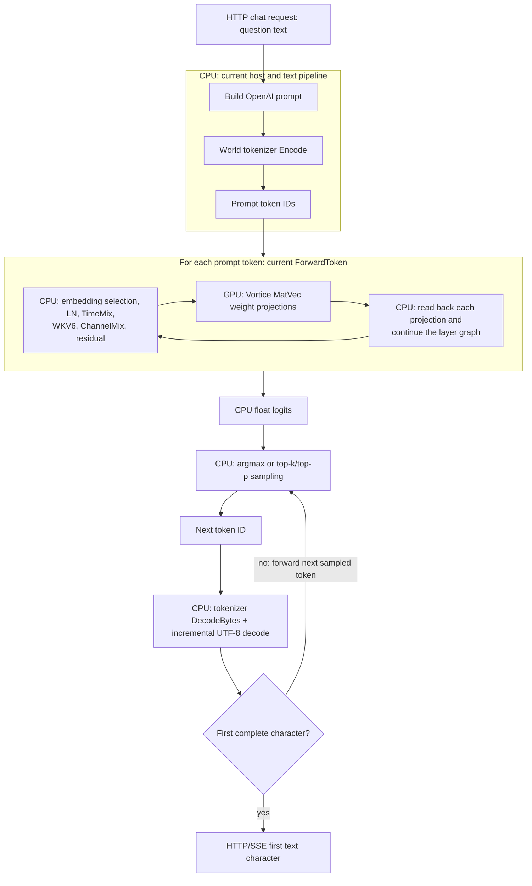
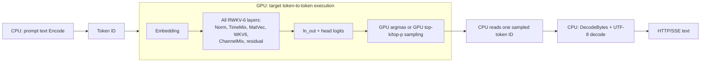

# SharpInference 架构设计

> 当前默认执行路径已切换为编译式 VM：CPU 生成 C#/程序集，D3D12 生成 HLSL/DXIL；
> 逻辑图仍是模型前端，执行程序改为固定槽位、NodeDefinition/调用与显式 State。
> 引擎维护 Prefill/Inference 两个有界队列，默认各 2 个可复用 VM，整段回复持有
> 一个 Inference VM。独立程序、共享物理权重/State、产物重载、调优和无编译部署见
> [Compiled inference VM](vm-execution-program.md)，该文是当前运行时契约。
> 下文保留此前设计和测量历史，不应将旧 API、性能数据或配置当作当前 VM 行为。
> Runtime 已移除旧执行图 XML 导入、primitive debug、旧双图 Prefill optimizer
> 和 legacy backend 接入；保留的数学参考工具不能作为生产 Processor 的第二路径。

> 当前实现以基础算子逻辑图为唯一推理路径；`Processor.Load` 和 Web API
> 均通过 RWKV-6/7 图 provider、通用优化器和 CPU/Vortice 图后端执行。
> 下文记载的专属架构、旧 GPU 批处理与双路径迁移方案是设计历史，不再是可选运行方式；
> 调用方不应依赖旧架构类、旧专属后端或 `portable-*` runtime kind。
> 删除前源码已保存为独立 ZIP，供必要时离线核对，而非运行时回退路径。
> 切换旧路径生成的状态快照时，须按新图的状态 ABI 和模型指纹重新验证；
> 不能保证旧快照与图会话兼容。

## 1. 目标与范围

SharpInference 是一个使用 .NET 10 实现的本地  推理库。当前支持
RWKV-6（x060）和 RWKV-7（x070）的单 token 解码和提示词预填充。RWKV-7
目前使用托管 CPU 推理；RWKV-6 还可选择 Windows Direct3D 12 GPU 后端。

第一阶段的约束如下：

- 支持托管 CPU 推理及可选的 Windows Direct3D 12 GPU 推理。
- 递归状态、归一化和 logits 始终以 `float`（FP32）参与计算。
- 支持 rwkv.cpp 兼容的 GGML x060 FP32/FP16 张量；读取阶段允许只读文件映射，
  CPU 后端持有独立权重并在首次使用 FP16 张量时转换为 FP32，GPU 后端持有独立显存权重。
- 不实现量化张量、LoRA、并行 scan 预填充或聊天 UI；提供 World
  `rwkv_vocab_v20230424` tokenizer 和流式文本生成 API。
- 首期的正确性优先于吞吐；预填充以重复调用单 token 前向实现。

上述限制避免在数值正确性尚未验证前，同时引入量化反解码、设备抽象和架构差异。
量化存储与硬件加速会作为张量存储/算子后端的扩展，而不是改写 RWKV-6 递推逻辑。

> 本节保留项目初期的约束与设计背景；当前实现的双图预填充路径见文末新增章节。

## 2. 参考实现与设计依据

本设计以 `D:\GithubRoot\rwkvcpp` 的 x060 路径为行为参考，尤其是：

- `rwkv_model_loading.inc`：x060 必需权重键和形状。
- `rwkv_graph.inc`：动态时间混合、WKV6、FFN 和残差计算顺序。
- `rwkv_eval.inc`：单 token 和分块序列前向的状态传递语义。
- `rwkv_file_format.inc`：rwkv.cpp GGML 文件头、张量头和数据类型编码。
- `tests\expected-logits-6v0-3m.bin`：x060 logits 的互操作验证基线。
- `D:\RWKVModels\RWKV-x060-World-1B6-v2.1-20240328-ctx4096.pth`：真实
  RWKV-6 World 1.6B 集成测试模型（约 2.98 GiB）。

rwkv.cpp 对 v5 及以上每层状态的平铺顺序是：

```text
[ffn_xx: nEmbed]
[att_xx: nEmbed]
[att_heads: headCount * headSize * headSize]
```

其中 `ffn_xx` 和 `att_xx` 是上一 token 的层归一化输入；`att_heads` 是按
attention head 划分的 FP32 矩阵递归状态。SharpInference 在逻辑上保留这一结构，
但状态序列化格式由本项目独立定义，不能假定和 rwkv.cpp 的二进制快照兼容。

## 3. 解决方案与目录结构

代码置于 `src`，包括模型无关图 IR、CPU/GPU 后端、RWKV-6/7 图 provider
及测试项目：

```text
src/
  SharpInference.Abstractions/
    SharpInference.Abstractions.csproj
    Architecture/
    Model/
    Runtime/
  SharpInference.Core/
    SharpInference.Core.csproj
    Loading/
    Runtime/
    Tensors/
    Sampling/
  SharpInference.Graphs/
    SharpInference.Graphs.csproj
  SharpInference.Gguf/
    SharpInference.Gguf.csproj
  SharpInference.Runtime/
    SharpInference.Runtime.csproj
  SharpInference.Models.Rwkv/
    SharpInference.Models.Rwkv.csproj
    Architecture/
      Rwkv6/
      Rwkv7/
    Resources/
    Runtime/
  SharpInference.Models.Phi4/
    SharpInference.Models.Phi4.csproj
    Architecture/
    Instructions/
      Cpu/
      D3D12/
    Runtime/
      D3D12/
  SharpInference.Tests/
    SharpInference.Tests.csproj
    Architecture/
    Loading/
    Runtime/
    TestData/
  SharpInference.Gguf.Tests/
    SharpInference.Gguf.Tests.csproj
```

每个模型族仅有一个项目：`Models.Rwkv` 合并公共契约、词表、RWKV-6/7 图与运行时助手；
`Models.Phi4` 合并模型架构、算子契约、CPU/D3D12 指令和直接组件。
现有公开命名空间不变，目录区分内部职责。Phi4 同一项目同时提供 `net10.0` 与
`net10.0-windows10.0.19041.0`，普通目标不编译 D3D12 指令/组件，也不引用 Windows 后端。
通用指令、图、格式读取和后端适配器仍是独立的模型无关项目。

`Models.Rwkv/Architecture/Rwkv7` 的逻辑图表达 rwkv.cpp GGML x070 FP32/FP16 权重的
推理语义，由通用 CPU 或 GPU 图后端执行。x070 每层状态仍按 `ffn_xx`、
`att_xx`、`att_heads` 排列，
因此会话分叉、重置和状态快照 API 无需区分架构。快照中的架构 ID、模型哈希和
状态长度会阻止跨模型或跨架构误加载。
Web API 对 RWKV-7 G1 使用 `System:` / `User:` / `Assistant:` 对话轮次，
轮次之间用两个换行分隔，并以不带尾随空格的 `Assistant:` 结束提示词；
输入消息中的连续换行会压缩为单个换行。RWKV-7 支持 CPU 与 Vortice 图后端。

图路径可通过 `Processor.LoadGraph(path, logicalGraph, backend)`
或 `Processor.LoadGraph(path, provider, backend)` 显式使用；后者在一次 Processor
构造过程中由 provider 生成图，并从图读取架构和模型签名，不依赖硬编码的
RWKV-6/7 架构检测，也不要求调用方额外打开模型文件。Reader 在
构造完成、后端接管权重后立即释放，CPU 后端保留其自有权重，GPU 后端持有显存权重。
Web API 的 `Rwkv:Runtime:Kind` 接受 `cpu`、`vortice` 或 `d3d12`（亦可使用
`--runtime-kind` 设置）；没有配置该值时使用编译式 CPU VM，随附
`appsettings.json` 则显式选择 Vortice。GPU 模式沿用
`Rwkv:Runtime:Vortice:AdapterIndex` 选择设备，由 Processor 持有和释放。
`GraphArchitectureMetadataReader` 根据外部提供图的模型签名和权重描述验证文件，
`PortableGraphArchitecture` 在构造 Processor 时由后端接管权重，并依据图的
GraphState 创建会话。`CpuPrimitiveGraphBackend` 和
`VorticePrimitiveGraphBackend` 可运行受支持的基础算子图；后者在显存中保留权重、
状态和中间资源，状态复制仅发生于显式读取、分叉等边界。两个后端对未知算子和
不支持的形状明确报错。`PortableRwkv6GraphProvider` 和
`PortableRwkv7GraphProvider` 将完整单 token 前向分解为模型无关基础算子；
默认 RWKV-6/7 路径也使用这些 provider；已通过 tiny FP32/FP16 模型逐 token
logits 和状态对照。有限的 tiny/7B 测试不能替代更全面的 RWKV-7 GPU 推理验收。
目前 tiny RWKV-6/7 FP32、FP16 的 CPU 与 GPU 图执行在多个 token 的 logits、
状态上完成对照；RWKV-7 G1 7.2B FP16 的可移植 CPU 与旧 CPU 路径完成两个
token 的 logits 和完整状态对照（发生在可移植 CPU 引入直接半精度矩阵读取之前，
随后优化的半精度直接计算路径又通过了 CPU/GPU 数值对照）。G1 7.2B 的
可移植 CPU 和 GPU 图在连续三个 token 后的完整 logits 和状态均通过
`0.005 * max(1, abs(expected))` 容差对照；GPU 会话分叉与快照恢复也通过。
一次短提示生成了 `4`，两次预热续写约 5.45–6.43 token/s（不同短样本）。
模型缓冲区约 14.4 GB，局部临时缓冲区通过生命周期复用约 2.16 GB，两会话
模型及缓冲区提交量峰值约 18.79 GB（不等同于物理显存驻留量，不含驱动开销）。
大型模型更长上下文和稳定性能测量仍待完成。
在同一 RX 7900 XTX 上，tiny RWKV-6 FP32 的八 token 预热短样本测得旧 Vortice
优化路径约 1094 token/s、基础图 GPU 路径不融合约 71 token/s、开启通用逐元素
融合约 77 token/s（结合安全的零 dispatch reshape 复用，dispatch 约 1553
降至 1187 次/token）。**通用 GPU 图路径目前仍比旧专属优化路径慢约 14 倍**；
该差距说明现有融合与视图/归约执行规划尚
不能达到历史专属实现的性能；旧执行路径现已删除，后续需继续优化通用图执行。
历史上，静态标量 token 图可为每个 GPU 会话缓存并重放 D3D12
命令列表。当前编译式 VM 由后端管理命令缓存，已移除
`--enable-command-replay` 和 `Rwkv:Runtime:Vortice:EnableCommandReplay`。
此前同机上另一组三次八
token 短样本约为旧路径 1150、可移植逐次录制 72、可移植命令重放
306 token/s。命令重放保留约 1187 次 kernel dispatch/token，但避免反复录制；
这一短样本仍约比旧优化路径慢 3.75 倍。大型模型启用重放后的性能和显存
占用尚未验证。
通用优化器在证明安全时删除无用的纯临时节点，并在后端同时声明能力和实现时
融合连续的 FP32 逐元素表达式；不支持融合的后端仍按基础图执行。可移植 CPU
后端复用工作区，对只被 MatVec/GatherRow 消费的 FP16 只读权重直接使用半精度
存储，避免为大型矩阵常驻一份 FP32 副本。单独进程对 G1 7.2B FP16 的一次
可移植 CPU 冷 token 验证中，reader 释放后约 13.69 GiB private，执行后约
13.98 GiB。改进原生半精度矩阵计算后，另一独立进程的两 token 验证测得
约 13.99 GiB private 峰值、首个 token 2.87 秒、第二个 2.06 秒；
这些短样本不能替代持续吞吐基准。Web API 使用 Vortice 图后端运行该模型
完成了十个短问答：事实答案均可识别，其中一个数列题在 16/64 token
输出限制下生成了未结束的 `<think>` 段落，没有遵守“只回答数字”的格式要求。

依赖方向必须是单向的：

```text
Application
    |
    +--> SharpInference.Core ----------> SharpInference.Abstractions
    |          ^
    |          |
    +--> SharpInference.Models.Rwkv
    |
    +--> SharpInference.Models.Phi4
```

`Abstractions` 不引用任何实现项目。`Core` 不引用某个特定版本插件；应用在启动
时显式注册插件，或由受控的程序集扫描发现插件。架构插件只依赖
`Abstractions`，可选地依赖 `Core` 提供的受控 CPU 算子接口。

## 4. 核心领域模型与公共 API

以下类型位于 `SharpInference.Abstractions`。名称是实现建议，最终可因 .NET 命名约定
微调，但职责边界不可改变。

```csharp
public interface IRwkvArchitecture
{
    RwkvArchitectureId Id { get; }
    bool CanLoad(ModelTensorCatalog tensors);
    RwkvModelMetadata ReadMetadata(ModelTensorCatalog tensors);
    IRwkvModel Bind(ModelTensorCatalog tensors, RwkvModelMetadata metadata);
    IRwkvState CreateInitialState(IRwkvModel model);
    void ForwardToken(
        IRwkvModel model,
        int token,
        IRwkvState state,
        Span<float> logits,
        IRwkvCpuOps ops);
}

public interface IRwkvModel
{
    RwkvModelMetadata Metadata { get; }
    RwkvArchitectureId ArchitectureId { get; }
}

public interface IRwkvState : ICloneable
{
    RwkvArchitectureId ArchitectureId { get; }
    RwkvModelFingerprint ModelFingerprint { get; }
}
```

`ForwardToken` 原地推进 `state`，并写入长度为 `VocabularySize` 的 logits。它不做
采样、不持有会话状态，也不接受文本。这保证模型在多个会话之间可共享且线程安全。
调用方必须为每个并发会话持有独立 `IRwkvState`。

核心运行时通过 `Processor` 和唯一的 `ProcessorSession` 暴露图驱动的会话 API：

```csharp
public sealed class Processor : IDisposable
{
    public static Processor Load(string path);
    public ProcessorSession CreateSession();
    public void ExportLogicalGraph(Stream destination);
    public void ExportExecutionGraph(
        Stream destination,
        ProcessorExecutionGraphKind kind = ProcessorExecutionGraphKind.Inference);
}

public sealed class ProcessorSession
{
    public ReadOnlyMemory<float> ForwardToken(int token);
    public ReadOnlyMemory<float> Prefill(ReadOnlySpan<int> tokens);
    public ProcessorSession Fork();
    public void Reset();
    public void SaveState(Stream destination);
    public void LoadState(Stream source);
}
```

`ProcessorSession` 不保证可重入。每个实例通过轻量级同步保护一次只有一个前向调用；
`Fork()` 深复制状态，可用于分支采样或并发生成。模型权重不可变、可由任意数量的
会话共享。

完整文本推理由 `RwkvWorldTokenizer` 与 `RwkvTextGenerator` 提供。调用者显式加载
与模型匹配的 World 词表后，使用以下异步迭代器消费结果：

```csharp
var tokenizer = RwkvWorldTokenizer.Load(@"D:\path\rwkv_vocab_v20230424.txt");
await foreach (var text in RwkvTextGenerator.GenerateAsync(
    session, tokenizer, "User: Hello\nAssistant:",
    new RwkvGenerationOptions { MaxTokens = 128, Temperature = 0.8f, TopP = 0.9f }))
{
    Console.Write(text);
}

await foreach (var character in RwkvTextGenerator.GenerateCharactersAsync(
    session, tokenizer, "User: Hello\nAssistant:"))
{
    Console.Write(character);
}
```

`GenerateAsync` 每次产生一个已完成 UTF-8 文本 chunk；`GenerateCharactersAsync`
将这些 chunk 展开为单个 UTF-16 `char`，满足逐文字读取的调用模式。生成会推进传入
session 的状态，因此在枚举完成或释放前，调用者不得从其他线程同时操作同一 session；
如需并行生成，应先调用 `session.Fork()`。

## 5. 插件发现与注册

首期使用显式注册作为默认方式：

```csharp
var registry = new RwkvArchitectureRegistry();
registry.Register(new Rwkv6Architecture());

using var model = RwkvModel.Load(modelPath, registry);
```

`RwkvArchitectureRegistry` 的职责是：

1. 维护以 `RwkvArchitectureId` 为键的不可重复插件集合。
2. 在加载阶段依次调用 `CanLoad`，要求恰好一个插件匹配。
3. 匹配为零时抛出包含已检测权重键、文件版本和已注册架构列表的
   `RwkvUnsupportedArchitectureException`。
4. 多个匹配时抛出 `RwkvAmbiguousArchitectureException`，而不是选择第一个。

未来可提供 `RegisterFromAssembly(Assembly)`，只加载实现
`IRwkvArchitecturePlugin` 的公开、无参类型。扫描必须是显式调用，不在库加载时
自动扫描磁盘目录；这避免不可预测的程序集加载和安全边界问题。

每个插件包含三个彼此独立的职责：

```text
架构探测/权重绑定 -> 状态创建与验证 -> 单 token block 前向
```

因此 RWKV-7 可以替换时间混合、权重契约和状态实现，同时复用 GGML 读取、CPU
算子、模型生命周期、会话、状态快照容器和采样器。

## 6. 模型文件加载

### 6.1 首期文件契约

首期加载 rwkv.cpp 的 GGML 文件格式：

```text
file header:
  magic, version, nVocab, nEmbed, nLayer, defaultDataType

repeated tensor:
  dimCount, nameLength, dataType, dimensions..., UTF-8 name, raw data
```

加载器必须使用 `FileStream` 配合 `RandomAccess.Read` 或内存映射读取，而不是将整个
模型复制到托管堆。`ModelTensorCatalog` 仅保存名称、维度、类型、文件偏移和字节数；
`TensorStorage` 在绑定时提供只读张量视图。

当前实现接受：

- 1、2、3 维张量；
- FP32 或 FP16 原始张量；
- 与模型头部 `nEmbed`、`nLayer`、`nVocab` 一致的形状；
- 一个且仅一个与 x060 权重契约匹配的架构。

文件长度、magic、版本、张量维数、类型、名字长度、偏移计算和每个张量字节数都必须
在读取时进行溢出检查。重复张量名、截断数据、未知必需键和不匹配形状必须报告明确
异常，绝不能降级为零权重或尝试其他架构。

FP16 按其真实的 2-byte IEEE 754 binary16 payload 读取，绝不将其误解释为 FP32。
量化类型（Q4/Q5/Q8 等）仍明确拒绝，并在错误消息中说明尚未实现其解码器。

提供的 1.6B 模型是 PyTorch `.pth` checkpoint，而不是 rwkv.cpp GGML 文件。第一阶段
不在生产库中直接解析 pickle/PyTorch checkpoint，原因是这会引入 Python/PyTorch
依赖、扩大不可信反序列化攻击面，并与本阶段的部署格式目标无关。该文件只作为测试
资产来源，由测试准备脚本调用参考工程的
`D:\GithubRoot\rwkvcpp\python\convert_pytorch_to_ggml.py` 生成 FP32 或 FP16 GGML
模型。转换产物与原始测试模型放在同一个目录，文件名必须包含数据类型，且不能覆盖
原始 `.pth` 文件。

### 6.2 RWKV-6 权重契约

`Rwkv6Architecture` 要求以下全局张量：

```text
emb.weight
blocks.0.ln0.weight
blocks.0.ln0.bias
ln_out.weight
ln_out.bias
head.weight
```

每个 `blocks.{i}` 必须包含：

```text
ln1.weight / ln1.bias
att.time_maa_x, att.time_maa_w, att.time_maa_k, att.time_maa_v
att.time_maa_r, att.time_maa_g, att.time_maa_w1, att.time_maa_w2
att.time_faaaa, att.time_decay, att.time_decay_w1, att.time_decay_w2
att.key.weight, att.value.weight, att.receptance.weight
att.gate.weight, att.output.weight
att.ln_x.weight, att.ln_x.bias
ln2.weight / ln2.bias
ffn.time_maa_k, ffn.time_maa_r
ffn.key.weight, ffn.value.weight, ffn.receptance.weight
```

插件从 `att.time_faaaa` 和状态相关张量导出 `HeadCount`、`HeadSize`，并验证：

```text
nEmbed == headCount * headSize
所有 layer 使用相同的 headCount 和 headSize
投影输入/输出维度与 nEmbed 一致
```

权重键完整性不能仅依赖文件头“版本号”，因为 rwkv.cpp 的 GGML 头部不携带 RWKV
架构版本。x060 的键集合和形状是架构识别的权威来源。

## 7. RWKV-6 单 token 执行路径

CPU 算子按 `float` 计算；FP16 权重第一次由 CPU 路径访问时转换并缓存为 FP32。GPU
路径不建立该缓存，而是上传原始 FP16 bit pattern（每个 `uint` 包含两个 half）；shader
使用 `f16tof32` 解码后以 FP32 乘法和 FP32 累加计算。这样减半 GPU 上 FP16 权重的
存储与上传量，同时保持 FP32 的状态和数值稳定性。

每个 token 的处理顺序必须和参考实现一致：

```text
x = LayerNorm(embedding[token], ln0)

for every layer:
    a = Rwkv6TimeMix(LayerNorm(x, ln1), attPreviousX, wkvState)
    x = x + a
    f = Rwkv6ChannelMix(LayerNorm(x, ln2), ffnPreviousX)
    x = x + f

logits = head * LayerNorm(x, ln_out)
```

### 7.1 TimeMix

RWKV-6 TimeMix 的插件内核遵循 `rwkv_att_v6`：

1. 读取层归一化后的 `x` 与保存的 `attPreviousX`，计算 `sx = previous - x`；
2. 使用 `time_maa_x`、`time_maa_w1`、`time_maa_w2` 产生 `mw/mk/mv/mr/mg`；
3. 与 `time_maa_[w,k,v,r,g]` 合成 `xw/xk/xv/xr/xg`；
4. 投影得到 `r/k/v`，并计算 `g = SiLU(gate * xg)`；
5. 通过 `time_decay_w1/w2`、`time_decay` 得到
   `w = exp(-exp(...))`；
6. 以 `(k, v, r, time_faaaa, w)` 更新各 head 的 WKV6 矩阵状态并读取输出；
7. 对输出进行以 `headCount` 分组的 GroupNorm（epsilon 为 `64e-5`），应用
   `ln_x` 仿射变换、门控 `g`，最后执行 `att.output` 投影；
8. 在所有依赖旧值的计算完成后，将 `attPreviousX` 更新为当前归一化输入。

WKV6 的内部循环应由 `IRwkvCpuOps.Wkv6` 表达，初版纯 C# 实现以正确的朴素循环
作为基线；后续可用 `Vector<T>`、硬件内在函数或原生后端替换，接口和数学语义不变。
状态更新使用 FP32，并明确规定读旧状态、写新状态的顺序，禁止在尚需读取旧值时原地
覆盖。

### 7.2 ChannelMix

RWKV-6 ChannelMix 使用它自己的上一输入状态：

```text
sx = ffnPreviousX - x
xk = x + sx * ffn.time_maa_k
xr = x + sx * ffn.time_maa_r
r = sigmoid(ffn.receptance * xr)
k = square(relu(ffn.key * xk))
ffn = r * (ffn.value * k)
```

完成 `xk/xr` 计算后更新 `ffnPreviousX`。该路径不共享 TimeMix 的 previous-x
缓冲区。

## 8. 张量与 CPU 算子边界

`SharpInference.Core` 提供只读的行主序张量视图及 `IRwkvCpuOps`：

```csharp
public interface IRwkvCpuOps
{
    void MatVec(in MatrixView matrix, ReadOnlySpan<float> input, Span<float> output);
    void LayerNorm(ReadOnlySpan<float> input, ReadOnlySpan<float> weight,
                   ReadOnlySpan<float> bias, float epsilon, Span<float> output);
    void GroupNormByHead(Span<float> values, int headCount, int headSize, float epsilon);
    void Wkv6(in Rwkv6WkvArguments arguments);
}
```

架构插件不直接使用 SIMD 内在函数或文件偏移；它只组合张量视图和算子。这样的分层使
下列优化可独立推进：

- `ScalarCpuOps`：首个正确性实现。
- `SimdCpuOps`：在语义测试相同的前提下使用 .NET 10 SIMD。
- 将来 `GpuOps`：把矩阵投影和 WKV6 映射至 GPU。
- `ITensorDecoder`：支持按块解码量化权重，而不改变架构插件。

首个实现将临时向量作为会话状态拥有的可复用数组：创建会话时分配一次，在每个 token
的热路径中不分配数组、LINQ 枚举或装箱对象。reader 的只读内存映射仅存在于构造期间；
构造成功前 CPU 后端复制所需权重，GPU 后端完成权重上传并等待拷贝完成。运行期模型
不得引用 reader 的张量数据。后续在支持批处理后可将临时缓冲区迁移到 `ArrayPool<float>`，但必须保持
同样的生命周期和无热路径分配语义。

## 9. 状态、快照与并发

`Rwkv6State` 是私有的可变实现，逻辑结构如下：

```text
Rwkv6State
  architectureId = "rwkv-6"
  layers[layerIndex]
    ffnPreviousX  : float[nEmbed]
    attPreviousX  : float[nEmbed]
    wkv            : float[headCount, headSize, headSize]
```

初始状态所有元素为零。会话在前向前检查 token 在 `[0, nVocab)`；非法 token、
状态架构不匹配或 logits 缓冲区长度错误必须抛出可诊断异常。

`ProcessorSession` 的状态文件使用 GGUF v3。独立的 GGUF project 处理二进制
metadata 和张量读写：状态 metadata 仅记录 `StateSchema.Name`，张量仅包含
推理图 `GraphState` 声明的具名数据槽位。backend 负责获取当前状态及恢复资源；
未运行前向也可以保存初始状态。读取时匹配 schema 名称以及全部张量的名称、类型、
维度、数据长度和布局契约。文件不包含 checksum 或模型指纹，不会验证数据数值本身，
也无法识别同构但权重不同的模型。先完成结构校验，再向 backend 提交状态。

`Processor.ExportLogicalGraph(Stream)` 与 `ExportExecutionGraph(Stream, ProcessorExecutionGraphKind)`
将相应图导出为 UTF-8 JSON，写入从流当前位置开始且不关闭流；execution 默认导出
inference，也可指定 prefill。缺少对应的 logical 或 prefill 图时抛出异常。
XML logical/execution 图的 builder 加载入口保持不变。

对外状态快照和编辑统一使用 `SaveState(Stream)` / `LoadState(Stream)`：要求可定位的流，分别从当前位置写入、
  从当前位置读取至流末尾；写入不会截断流，已有的尾部字节仍保留，但读取会拒绝
  多余的尾部字节。调用后流仍保持打开。可传入文件流保存／加载 GGUF 状态文件；
  内存流复用前应将 `Position` 重置到快照起始位置。编辑时按名称读取 GGUF FP32
  张量，保持 schema、名称、类型、维度与数据长度，并写入新的 GGUF 文件再加载。
  不提供关闭校验和的开关，因为文件根本没有校验和。

外部编辑必须只作用于同一模型导出的状态；不满足数值稳定性要求的修改可能产生非有限
logits，调用者应在导入后的第一步前向后检查结果。

`Processor` 可为同一模型创建多个会话。`ProcessorSession` 的状态是可变的且非并行使用；
并发生成通过创建多个 session 或 `Fork()` 实现，绝不共享可变状态。

## 10. RWKV-7 扩展方案

RWKV-7 通过单独的 `Rwkv7Architecture` 接入，而不是在 `Rwkv6Architecture` 中增加
条件分支。它将实现相同的 `IRwkvArchitecture`，但拥有：

- 独立的权重键契约（如 `att.w*`、`att.a*`、`att.g*`、`att.k_k`、`att.k_a`、
  `att.r_k` 及可选的 `att.v*`）。
- 独立的 delta-rule / 动态状态演化内核。
- 相同的持久状态类别：两份 previous-x 与矩阵状态。
- 仅在单次 `ForwardToken` 调用内存活的 `v_first` 临时值；它不是跨 token 快照状态。
- 对 key 归一化、状态修正项和数值稳定性更严格的测试要求。

通用宿主不暴露 `Rwkv6State`，也不根据模型版本对状态数组作假设，因此 x070 可以有
不同的内部状态布局。任何从 x060 到 x070 的状态导入必须被拒绝。

## 11. 测试与验收

### 外部 tiny 模型配置

当前使用 xUnit 2；其 VSTest 适配器不提供 MSTest 的 `TestContext.TestRunParameters`。
需要真实模型的测试通过 `dotnet test -p:RwkvTestModelDirectory=<目录>` 传入
MSBuild 测试项目参数，构建时将参数写入测试程序集；加载器在该目录中查找
`tiny-rwkv-6v0-3m-FP32.bin`、
`tiny-rwkv-7v0-834K-FP32.bin`、`tiny-rwkv-7v0-834K-FP16.bin`、
`expected-logits-7v0-834K.bin` 和
`rwkv7-g1j-7.2b-20260831-ctx16384-FP16.bin`（用于不同低秩投影宽度的回归测试）。
若文件分散存放，可分别通过
`-p:RwkvTestRwkv6Model=...`、`-p:RwkvTestRwkv7Fp32Model=...`、
`-p:RwkvTestRwkv7Fp16Model=...`、`-p:RwkvTestRwkv7ExpectedLogits=...`、
`-p:RwkvTestRwkv7LargeModel=...`
传入绝对文件路径；单文件参数优先于目录参数。例如只运行 RWKV-6 相关测试：

```powershell
dotnet test src\SharpInference.Tests\SharpInference.Tests.csproj -p:RwkvTestRwkv6Model='F:\RWKV\RWKVModels\tiny-rwkv-6v0-3m-FP32.bin' --filter 'FullyQualifiedName~Rwkv6'
```

完整测试集还需提供 RWKV-7 模型和对应 logits。未配置、路径无效、文件缺失或
模型读取失败时相关用例都会报错，不会静默通过。参数在构建时生效；
更换路径时不要使用 `--no-build`，以免运行旧的测试程序集。

测试项目使用 xUnit，测试数据不应默认提交大模型。当前已实现 8 个快速测试，覆盖
GGML magic/截断边界，以及 snapshot 的回环、篡改和模型指纹拒绝。小型模型和
rwkv.cpp 基线可由脚本下载或从本机参考目录复制到被忽略的测试资产目录。

测试分为两层：

- **快速测试**：使用 `tiny-rwkv-6v0-3m` 和人工构造的小张量，默认在本地及 CI
  执行。首个实现的快速集还包含人工构造 GGML 文件与 snapshot，不要求模型文件。
- **真实模型集成测试**：使用
  `D:\RWKVModels\RWKV-x060-World-1B6-v2.1-20240328-ctx4096.pth`，验证真实 x060
  1.6B 权重上的加载、状态推进和 logits。该测试耗时且需要较多内存，默认不属于
  快速测试集合。

真实模型测试同样应通过测试项目参数传入路径，不在 xUnit 测试中硬编码本机路径；
模型不存在时必须报错并说明配置方式，不能伪装成成功，也不能自动从网络下载大模型。

测试准备命令负责：

1. 校验输入扩展名、文件存在性，并计算原始 `.pth` 的 SHA-256；
2. 调用 rwkv.cpp 转换器生成 GGML FP32/FP16 测试模型；
3. 以原始文件哈希、转换格式和转换器版本组成缓存键，避免使用过期产物；
4. 使用 rwkv.cpp 或官方 RWKV Python 实现，对固定 token 序列导出每一步 FP32
   logits 和状态；
5. 将转换模型和 golden trace 保存在 `.pth` 所在的 `D:\RWKVModels` 目录；测试
   通过输入模型路径推导关联产物，不在仓库中复制这些大文件。

已完成的 FP32 转换记录：

| 项目 | 值 |
|---|---|
| 转换日期 | 2026-09-23 |
| 源文件 | `D:\RWKVModels\RWKV-x060-World-1B6-v2.1-20240328-ctx4096.pth` |
| 源文件大小 | 3,199,845,663 bytes |
| 源文件 SHA-256 | `CDA1F0EBE802E2859BFA129546372FD1EAC60319111F215F65CED67DD334DB36` |
| 目标文件 | `D:\RWKVModels\RWKV-x060-World-1B6-v2.1-20240328-ctx4096-FP32.bin` |
| 目标文件大小 | 6,399,520,777 bytes |
| 目标文件 SHA-256 | `033AAF6D885ACF6F223CE9BF074ACC7F7DB54E2185D36A2ABA95883345D7F256` |
| 转换器 | `D:\GithubRoot\rwkvcpp\python\convert_pytorch_to_ggml.py` |
| Python 环境 | 既有 `C:\Users\buche\.conda\envs\rwkvtest`，Python 3.12.13，PyTorch 2.14.0+cpu |
| GGML 头 | magic `0x67676D66`，version 101，FP32，vocab 65536，embed 2048，24 layers |

转换器正常检测到 RWKV v6.0 并完成全部张量写入。上述既有 `rwkvtest` 环境不是本项目
创建或拥有，因此本项目不负责删除它；本次转换没有创建新的 Conda 环境，也没有安装
或修改其依赖。

`.pth` 属于受信任的本地测试输入，但准备脚本仍不得在 SharpInference 进程中反序列化它；
只允许显式启动的外部转换步骤读取。CI 若需要真实模型测试，应由 CI 的受控资产存储
提供模型，并显式设置路径和启用开关。

### 11.1 可选 Miniconda 开发环境

本机 Miniconda 位于 `C:\ProgramData\miniconda3`（设计时检测版本为 26.5.3），但
`conda` 不在当前 shell 的 `PATH`。它只用于 `.pth` 转换和 Python 参考 trace 生成，
不属于 SharpInference 运行时依赖，也不能被 `dotnet build`、快速测试或 NuGet 包要求。

设计阶段不创建环境。首次确实需要运行 Python 转换器时，才按以下固定契约创建：

| 项目 | 约定 |
|---|---|
| 环境用途 | RWKV checkpoint 转换和参考 logits/state 生成 |
| 环境前缀 | `D:\source\repos\SharpInference\.dev\conda-sharpinference` |
| Conda 可执行文件 | `C:\ProgramData\miniconda3\Scripts\conda.exe`，也可由 `CONDA_EXE` 覆盖 |
| 依赖清单 | `tools\environment.reference.yml`，创建环境前必须提交或更新 |
| 本地产物 | `.dev\`，整个目录加入版本控制忽略 |
| 生产依赖 | 无 |

环境使用 `--prefix` 而不是全局名称，以便明确归属并避免污染用户的其他 Conda 环境。
脚本使用 `conda run --prefix`，不修改全局 shell profile，也不要求 `conda activate`：

```powershell
$conda = if ($env:CONDA_EXE) {
    $env:CONDA_EXE
} else {
    'C:\ProgramData\miniconda3\Scripts\conda.exe'
}

& $conda env create `
    --prefix 'D:\source\repos\SharpInference\.dev\conda-sharpinference' `
    --file 'D:\source\repos\SharpInference\tools\environment.reference.yml'

& $conda run `
    --prefix 'D:\source\repos\SharpInference\.dev\conda-sharpinference' `
    python 'D:\GithubRoot\rwkvcpp\python\convert_pytorch_to_ggml.py' `
    $env:SHARPINFERENCE_TEST_MODEL_PTH `
    'D:\RWKVModels\RWKV-x060-World-1B6-v2.1-20240328-ctx4096-FP32.bin' `
    FP32
```

依赖清单至少固定 Python 主次版本和 CPU 版 PyTorch；只有参考脚本实际导入的包才能
加入。禁止把 CUDA、Jupyter 或开发者个人工具加入该环境。创建或更新环境后，执行者
必须同步更新本节的“设计阶段不创建环境”状态描述，记录实际创建日期和依赖清单变更，
确保文档始终能回答“是否创建、在哪里、为什么创建、如何删除”。

不再需要 Python 参考工具时，使用以下命令清除环境：

```powershell
$conda = if ($env:CONDA_EXE) {
    $env:CONDA_EXE
} else {
    'C:\ProgramData\miniconda3\Scripts\conda.exe'
}

& $conda env remove `
    --prefix 'D:\source\repos\SharpInference\.dev\conda-sharpinference' `
    --yes
```

清理后用 `Test-Path 'D:\source\repos\SharpInference\.dev\conda-sharpinference'` 验证前缀已不存在。
转换后的测试模型和 trace 不会被 `conda env remove` 删除；若需清理，应分别删除
`D:\RWKVModels` 中已确认不再使用的具体转换文件，不能对测试模型目录、仓库根目录
或含通配符路径执行递归删除。

### 11.2 必须覆盖

1. **文件解析**
   - 正常 FP32/FP16 文件；
   - 截断文件、错误 magic/版本、重复键、未知数据类型、溢出尺寸；
   - 量化文件被明确拒绝。
2. **架构绑定**
   - x060 完整键集被唯一识别；
   - 缺少任一必需键、形状不匹配、x070 键集均失败且含可诊断信息；
   - 注册表的零匹配和多匹配失败。
3. **数值单元测试**
   - LayerNorm、GroupNorm、SiLU、FP16 转换、MatVec 和 WKV6 的小张量手算结果；
   - WKV6 验证每一步先读旧状态再写新状态。
4. **端到端互操作**
   - 对 rwkv.cpp 的 `tiny-rwkv-6v0-3m`，使用固定 token 序列；
   - 每个 token 比较完整 logits、持久状态和最终 argmax；
   - 基准数据优先来自 `expected-logits-6v0-3m.bin` 或由参考实现导出的 trace。
   - 对提供的 x060 World 1.6B `.pth` 转换模型，至少覆盖空状态首 token、包含中英文
     的固定提示序列、连续解码、状态导出恢复和最终 logits；
   - 1.6B 测试必须验证模型指纹与 golden trace 匹配，禁止拿其他转换产物替代。
5. **状态行为**
   - 空状态等价于显式全零状态；
   - `Fork` 后相同 token 得到相同输出；
   - 分叉后的不同 token 不互相污染；
   - 导出再导入后续 token logits 一致；
   - 不同模型、不同架构的快照被拒绝。

### 11.3 数值容差

FP32 权重的端到端 logits 以 `max(abs(actual - expected)) <= 2e-4` 为初始目标；
FP16 权重以 `<= 5e-4` 为初始目标。实际容差必须通过与 rwkv.cpp 相同模型、相同 token
序列的测试确认后固化，不得以“输出文本看起来合理”代替 logits 验证。

首次真实模型互操作验证已于 2026-09-23 完成：对同目录的 FP32 GGML 模型处理 token
序列 `[0, 10, 13, 42]`，SharpInference 与 rwkvcpp 的 262,144 个 logits 最大绝对误差为
`1.41143799e-4`，平均绝对误差为 `1.17987552e-5`，四步 argmax 均相同。误差来自
托管标量循环与 rwkvcpp 的 CPU FMA/归约顺序不同；该结果确立了上述 FP32 初始阈值。

性能基线（2026-09-23，11th Gen Intel Core i7-11370H、8 logical processors、32 GiB
RAM、RWKV-6 World 1.6B FP32）对独立输出行使用 `Parallel.For` 并行。点积采用
`System.Numerics.Tensors` 10.0 的 `TensorPrimitives.Dot(ReadOnlySpan<float>,
ReadOnlySpan<float>)`，而非高层 `Tensor<T>` 容器；这样保持 GGML 内存映射权重的
零复制 span 访问，同时使用运行时优化的 SIMD 归约。

既有 6-token 集成流程（含 state snapshot round-trip）依次从标量实现的 `63.24 s`
降至手写 `Vector<float>` SIMD 的 `17.41 s`，再降至 `TensorPrimitives.Dot` 的
`12.13 s`。当前实现相对标量约 **5.2x**，相对手写 SIMD 约 **1.44x** 更快。
Tensor primitives 版本与 rwkvcpp 对 token 序列 `[0, 10, 13, 42]` 的 262,144 个
logits 比较，最大绝对误差为 `9.15527344e-5`、平均绝对误差为
`7.68082521e-6`，四步 argmax 均相同，仍低于 `2e-4` 阈值。该数据是本机端到端
基准，不代表不同 CPU、内存带宽、并发请求数或量化模型的性能。

### 11.4 已移除的 ComputeSharp 后端

ComputeSharp 后端已移除。其 Shader Model 6.0 代码生成路径不能提供项目需要的原生 FP16 运算，继续维护会与 Vortice DX12 后端重复。Windows GPU 推理统一由 Vortice 后端提供 FP32、原生 FP16 和明确的 FP16 fallback。

### 11.5 Vortice Direct3D 12 后端设计

`SharpInference.Backends.Vortice` 是 Windows Direct3D 12 GPU 后端。它使用
`Vortice.DXGI` 选择硬件 adapter、`Vortice.Direct3D12`
创建 resource、descriptor、command queue 和 fence，使用 `Vortice.Dxc` 将项目内嵌
HLSL 在构建期编译为 DXIL。HLSL 必须作为独立文件保存在 `Shaders` 目录，不能作为
C# 字符串嵌入源代码；同名 HLSL 与 DXIL 均嵌入
`SharpInference.Backends.Vortice.dll`，调用方和发布宿主无需复制或引用 shader 文件。目标是支持 FP32 权重，以及在硬件允许时的**原生 FP16
MatVec 乘法 + FP32 累加与递归状态**。

#### 精度自动判定

不根据文件名、GGML file header 的 default type 或命令行参数猜测精度。GGML v101 的
每一个 tensor header 已由 `IModelTensor.DataType` 暴露，并且同一文件可以混合 FP16
和 FP32；tiny FP16 模型即为 98 个 FP16、244 个 FP32。Vortice 后端以每个
`IModelTensor` 的真实 header type 创建和缓存 immutable GPU resource：

| tensor type | `Native16BitShaderOpsSupported` | resource / shader |
|---|---:|---|
| FP32 | 任意 | FP32 `StructuredBuffer<float>`，FP32 MatVec |
| FP16 | true | 2-byte stride FP16 structured/typed SRV，`float16_t` MatVec |
| FP16 | false | 2-byte FP16 storage，`f16tof32` 后执行 FP32 MatVec，并记录降级日志 |

设备创建后查询 `D3D12_FEATURE_D3D12_OPTIONS4.Native16BitShaderOpsSupported`。只有它为
真，才允许 native FP16 dispatch。该检查是 per-adapter 的；FP16 GGML 模型在不支持的
硬件上仍可运行，但不得声称它使用原生 FP16 算术。WARP/软件 adapter 保持拒绝。

Native FP16 shaders 由 DXC 用 `cs_6_2`（或更新）和 `-enable-16bit-types` 编译。
权重与由 FP32 activation 显式窄化得到的输入均使用 `float16_t`；其乘积立即提升并加入
`float` 局部和，group-shared reduction 与输出保持 FP32。Norm、TimeMix、WKV6、
残差、logits 和全部 RWKV recurrent state 均保持 FP32。

#### Shader 源码、构建产物与动态组合

当前的 FP32、native FP16 与 FP16-storage/FP32-compute MatVec 各自拥有独立的
`.hlsl` 文件。`SharpInference.ShaderCompiler` 在构建期调用 DXC，生成同名
`<source>.hlsl.dxil` 文件；MSBuild 以 HLSL 源文件为输入、DXIL 为输出，因此 DXIL
存在且源文件未变化时不会重新编译。两者作为具名 manifest resource 嵌入后端程序集；
运行时只读取嵌入的 `.dxil`，热路径和 runtime 构造都不调用 DXC 编译静态 shader。

未来可根据模型形状、权重精度、activation/intermediate 精度、累加精度、tile/wave
大小与 adapter capability，将多个 HLSL 片段组合成一个完整 kernel。当前没有运行时
动态编译实现；引入该能力时，应由独立的 backend 私有编译与缓存组件处理，并为每个
编译请求提供：

```text
modelFingerprint + kernelConfiguration + shaderProfile + generated HLSL source
```

四项共同构成缓存键。缓存默认位于应用程序目录的 `VorticeShaderCache` 子目录，仅保存
带逻辑源文件名和键哈希的 `.hlsl.dxil`；只要对应 `.dxil` 存在，就直接加载且**绝不启动
DXC**。动态生成的 HLSL 直接传给 DXC，不保留源文件；目录只会在首次需要生成 DXIL 时
创建。先在锁外检查缓存，只有未命中才取得进程内共享锁并再次检查；第二次仍未命中时才
编译和写入，保证命中路径不等待锁、并发未命中不会重复编译同一 variant。不提供跨进程
锁。模型权重变更、片段组合变更或生成源码变更会产生新键，不能复用旧的 DXIL。

FP8 只能作为未来动态 variant 的显式候选：必须先验证目标 adapter、D3D12 feature、
DXIL Shader Model、数据格式/scale 契约与独立数值基准；不得把它作为 FP16 或 FP32
的隐式 fallback。

#### 权重精度与显存规划

Vortice 在 `Rwkv6Architecture.Bind` 时通过 `IRwkv6ModelPreparationBackend` 接收完整
tensor catalog，而不是根据首次 MatVec 的单个权重决定精度。它计算完整模型的 FP32
footprint（所有 element 按 4 bytes）与 FP16 footprint（所有 element 按 2 bytes），并将
adapter dedicated local memory 的 85% 减去 256 MiB 保留量作为显存预算。缓存权重实际
分配在 D3D12 default heap，确保预算判断和 GPU-local 分配一致。

`VorticeRuntimeConfig.WeightPrecision` 的优先级如下：

| 设置 | 行为 |
|---|---|
| `Auto`（默认） | 文件含任一 FP16 tensor 时选择 FP16；否则若 FP32 footprint 在预算内选择 FP32；否则尝试 FP16。 |
| `Fp32` | 强制以 FP32 上传矩阵；GGML FP16 tensor 会转换为 FP32。 |
| `Fp16` | 强制以 FP16 上传矩阵；GGML FP32 tensor 会转换为 half。 |

所选精度的 footprint 超出预算时，无论自动或强制，model bind 都会抛出
`InsufficientMemoryException`，其中包含 adapter、预算、所需字节数和所选精度；绝不
静默改用 CPU 或其他精度。FP16 选择仍遵守 `AllowFp16Fallback`：native16 不可用时仅在
该项为 `true` 的情况下运行 FP16-storage/FP32-compute shader。

Vortice runtime 不直接写 `Console`。在完成规划后，它通过注入的
`ILogger<VorticeRwkv6MatVecBackend>` 以结构化字段记录最终/请求精度、模型是否含 FP16、
FP32/FP16 footprint、local-memory budget、native16 capability 和选择原因。Integration
创建 console logger provider；Web API 使用其 DI `ILoggerFactory`，使宿主独立决定日志
目标、等级和格式。

#### 项目和后端边界

新增项目：

```text
src/SharpInference.Backends.Vortice/
  SharpInference.Backends.Vortice.csproj
  VorticeRwkv6MatVecBackend.cs       // D3D12 MatVec backend
  Shaders/
    Rwkv6MatVecFp32.hlsl
    Rwkv6MatVecFp32.hlsl.dxil
    Rwkv6MatVecFp16.hlsl
    Rwkv6MatVecFp16.hlsl.dxil
    Rwkv6MatVecFp16Fallback.hlsl
    Rwkv6MatVecFp16Fallback.hlsl.dxil
src/SharpInference.ShaderCompiler/
  Program.cs                          // build-time DXC compiler
```

当前交付实现 `IRwkv6MatVecBackend`，因此 embedding 之后的各个矩阵投影走 D3D12；
LayerNorm、TimeMix、WKV6、state 和采样仍复用已验证的 CPU 执行。未来完整
GPU-resident 路径会另外实现 `IRwkv6AttentionComputeBackend` 和内部
`IRwkv6FullComputeBackend`。无论当前或后续阶段，`Rwkv6Architecture`、model loader、
session、state snapshot、tokenizer 和 Web API 都不接触 D3D12 细节。后端不由 `--gpu`、`--gpu-index`
或同类 runtime 专用命令行参数选择；宿主通过下述统一 runtime 配置组装它，默认 runtime
仍为 CPU。

CPU 与 Vortice 的资源和执行计划互不共享。一个 session 选定后端后，完整 token 前向
只在该后端执行，避免 activation 下载/上传。
`SaveState(Stream)` 与 `Fork` 等待 fence 后下载 FP32 state；`LoadState(Stream)`、外部 state 编辑和
`Reset` 上传或替换对应 FP32 state resource，保持现有状态语义。

#### GPU-resident 优化方案

当前 Vortice MatVec backend 的正确性路径在每一次矩阵投影中创建 input upload、default
output、readback resource 和 command list；dispatch 后立即 copy output、等待 fence 并交回
CPU。这会让 RWKV-6 每层约 11 次 MatVec 都发生 CPU/GPU 往返。7B 单 token 因而有数百次
小粒度 copy/synchronize，Task Manager 中 Copy engine 持续繁忙而 Compute/3D engine 不连续
是该实现的预期表现。专用显存中常驻的权重不应被误判为重复上传。

优化目标是让 Vortice 实现内部 `IRwkv6FullComputeBackend`，使一个 `ForwardToken` 成为单个
GPU-resident 执行图：

```text
token ID root constant
  -> embedding -> ln0
  -> 对每一层：TimeMix -> WKV6 state update -> residual
              -> ChannelMix -> residual
  -> ln_out -> head
  -> 唯一的 logits readback
```

除了创建/导入/导出/克隆/重置 session state，以及 token 末端的 logits 外，热路径不得有
CPU/GPU activation 往返、不得创建 D3D12 resource、不得编译 shader、不得等待中间 fence。
`/v1/chat/completions` 的采样仍可以保留在 CPU；因此每 token 允许读回一份 FP32 logits。
若未来将 sampling 移至 GPU，则可只回传 sampled token，但这不属于本阶段。

**资源与所有权**

| 资源 | D3D12 存储与生命周期 | 规则 |
|---|---|---|
| 模型权重 | default heap，backend/model 生命周期 | 沿用现有 `IModelTensor` identity cache；绑定后不可变。 |
| Pipeline/root signature/DXIL | backend 生命周期 | 静态 variant 从嵌入 DXIL 读取；动态 variant 先查 `VorticeShaderCache`，仅缺失时编译。 |
| session scratch | default heap，按 `Rwkv6State` identity 的 session resource bundle | 包含 `x`、norm、mix、r/k/v/g/w、FFN、中间归约缓冲区；首次前向创建，之后复用。 |
| `attPreviousX`、`ffnPreviousX`、WKV6 | default heap，按 session/layer 持久化 | GPU 是热路径权威副本；类型始终 FP32。 |
| logits | 每 session 持久 default heap + readback heap | 每 token 仅对最终 logits 做一次 GPU→CPU copy。 |
| upload staging | 每 backend 或 session 的可复用 upload ring | 仅用于 state import/reset、首次 session state upload，以及必要的 readback coordination；token ID 通过 root constant 传递。 |
| command allocator/list 与 fence event | backend 生命周期的池 | 每 token reset/reuse；不在 MatVec 或 layer 内创建。 |

每个 `ProcessorSession` 拥有独立 mutable resource bundle；同一 session 仍按现有契约不可并发
forward。不同 session 不得共用 scratch/state buffer。backend 可以共用 queue、PSO、权重与
descriptor heap，但提交顺序必须通过 per-submission fence value 跟踪，禁止一个 session 的
readback 覆盖另一个 session 的 logits。

**Token command graph**

单 token 录制一个 direct command list。embedding 的 token index 作为 root constant；所有
activation、state 与权重都以 default-heap SRV/UAV 绑定。每个 layer 在同一 command list
中按数据依赖插入 UAV barrier，不能在 layer 内 CPU wait：

1. `LayerNorm`、delta、static/dynamic mix、SiLU、sigmoid、tanh、decay、affine、residual
   等逐元素算子在 GPU dispatch；
2. `time_maa_w1/w2`、r/k/v/g、decay、att.output、FFN 三投影与 head 使用 MatVec
   kernels；
3. r/k/v/g 可各自 dispatch，但必须共享本 token command list、scratch bundle 与最终
   submission；后续可按矩阵形状生成 fused/multi-output variant；
4. WKV6 kernel 在 GPU 直接读写持久 FP32 WKV state；GroupNorm 采用统计与应用两个 GPU
   阶段；
5. `ln_out + head` 完成后，将最终 logits 从 default heap copy 到持久 readback buffer，
   command list close/submit 一次，随后仅等待该 token 的最终 fence。

这使热路径的 GPU→CPU transfer 从“每个 MatVec 一份向量”降为“每 token 一份 vocab logits”。
对标准单 token 路径，CPU→GPU transfer 应为零个 activation buffer（token 通过 root
constant）；GPU→CPU transfer 仅为 `VocabularySize * sizeof(float)`。state 操作是显式
同步点，不能隐藏在正常 forward 中。

**精度与 kernel variant**

第一版完整图保持下列数值契约：

- 模型权重沿用全模型 `Fp32`/`Fp16` 选择；FP16 native 路径继续使用 `float16_t` operand，
  FP32 local accumulation 和 FP32 output。
- activation、所有 norm/reduction、logits、`attPreviousX`、`ffnPreviousX` 和 WKV6 state
  均为 FP32，确保现有 snapshot/state 编辑语义和误差基线可复用。
- 允许在后续独立 variant 中将**非递归 scratch** 改为 FP16 storage/compute，但必须由
  `KernelConfiguration` 明确标记，不能影响 state 或悄悄替代 FP32 路径。
- FP8 继续不在本阶段启用；它需要独立的数据格式、scale、feature detection、kernel
  configuration 和数值验收，不能作为自动 fallback。

动态组合的 cache key 必须包含模型 fingerprint、矩阵/embedding/head 尺寸、权重精度、
activation/state precision、tile/wave configuration、shader profile 和完整生成源码。这样
同一模型与组合条件只编译一次，而不同 7B/1B6 模型、FP16/FP32 variant 或 tile 选择不会
错误复用 DXIL。

**实施阶段与验收**

| 阶段 | 交付内容 | 传输/同步目标 | 正确性与性能验收 |
|---|---|---|---|
| A：观测与资源复用 | D3D12 timestamp query、每 token dispatch/copy bytes/fence-wait 统计；复用 command allocator/list 和 staging resource。 | 不改变 CPU 算子语义；量化现有 copy/fence 成本。 | tiny trace 不变；日志能分别报告 GPU dispatch、copy、CPU fence 等待时间。 |
| B：持久 MatVec buffers | session scratch 的 default heap buffer、持久 logits/readback、真正的同一 command list `MultiplyBatch`。 | 删除每个 MatVec 的 resource allocation；仅在仍由 CPU 消费的边界 readback。 | 完整 logits 与当前 Vortice native FP16 baseline 比较；证明 r/k/v/g 不再有四次独立 submit。 |
| C：GPU TimeMix/ChannelMix | 逐元素、Norm、MaaW2、FFN activation、residual 都转 GPU；activation 不再回传。 | 每层零 readback、零中间 fence。 | CPU/Vortice fixed-token trace、state round-trip、Reset/Import/Fork 均通过。 |
| D：GPU WKV6 与完整 executor | 持久 WKV6/previous-x state；实现 `IRwkv6FullComputeBackend`。 | 每 token一份 logits readback、一次 queue submission、一次最终 fence wait。 | 在 tiny FP32/FP16 与真实 7B 上比较 logits/argmax/state；报告 tok/s、copy bytes/token、dispatch/token 与 GPU 时间。 |
| E：shape/precision specialization | 根据 cache key 生成 tile/wave、multi-output、可选 FP16 scratch variant。 | 不增加 host-device round trip。 | 每个 variant 单独 golden trace、数值阈值和吞吐基准；只保留可复现提升的 variant。 |

阶段 D 是解决 Copy-engine 主导现象的完成定义；仅做阶段 A/B 的资源复用会降低开销，但不会
消除 CPU 算子导致的往返。所有阶段必须保留 CPU 与 Vortice 的 runtime 可选性；
失败时抛出 D3D12/feature/resource 的明确错误，禁止静默退回 CPU。

**当前实施状态**

已完成阶段 A/B 的首个可交付优化：

- `VorticeExecutionMetrics` 累计并公开 MatVec dispatch、command-list submission、
  activation upload/readback bytes、实际 fence wait 时间及 transient buffer allocation；
  Integration 在结束时以多行格式输出该快照。
- `MultiplyBatch` 已将 r/k/v/g 等独立投影录制到一个 command list，执行一次 queue
  submission 和一次最终 fence wait；不再对 batch 中每个 projection 单独 submit/readback。
- upload/default-output/readback 三元组按 `(inputLength, outputLength)` 由 backend 资源池
  租用并在 fence 完成后归还；command allocator、graphics command list 与 fence event
  同样在 backend 生命周期内复用。
- 在本机 tiny FP16 模型的 16-token benchmark 中，3,192 MatVec dispatch 合并为 2,328
  command-list submissions；临时资源仅分配 4 组。logits hash、snapshot round-trip 和
  外部 state 编辑均保持原有结果。该 tiny benchmark 从 6.57 tok/s 提升至 8.35 tok/s，
  仅说明此批处理/资源复用的局部收益，不能外推为 7B 吞吐。

这一步仍会在每个 CPU/GPU 算子边界 readback，因而不会根除 Copy engine 利用率；完整
GPU-resident token graph 保持为阶段 C/D 的后续工作。

此前用于开发期 correctness oracle 的单线程 `Rwkv6FullTokenFp32` shader 已在并行 stage
路径具备稳定 logits、state 与 layer diagnostics 后删除。`Vortice:EnableFullGpuInference=true`
现在始终使用具名 stage 的并行 FP32 执行图，并将所有 stage batch 到同一 command list。

#### 执行图与交付顺序

当前执行图为每个 MatVec 一份 command list：权重保留为 immutable D3D12 resource，输入
上传、GPU 归约和 output readback 在一次 dispatch 内完成。FP32、native FP16 与
FP16-to-FP32 fallback 根据绑定 tensor resource 选择 PSO；选择和 DXIL 在构造时缓存，
热路径不会读取模型文件或编译 shader。后续完整 GPU-resident 执行图会合并 embedding、
Norm、TimeMix、WKV6、FFN、残差和 head，并在资源依赖间插入 UAV barrier。

实现及验证分为：

1. 新项目、adapter enumeration、D3D12 生命周期/fence 和 DXC diagnostics；以 FP32/FP16
   MatVec smoke test 验证 shader variant 和 native16 capability。
2. Immutable tensor cache 与 FP32 state cache；以 `IModelTensor.DataType` 覆盖混合模型，
   并验证 unsupported-native16 的明确 fallback。
3. 实现单次/batch MatVec，并对指定 tiny FP32 和 tiny FP16 模型验证 tokens
   `[0, 10, 13, 42]` 的所有 logits、argmax、snapshot round-trip 和外部 state 编辑。
4. 仅对 tiny 模型基准，并报告 adapter、native16 capability、实际 shader variant 与
   tok/s；不在当前 4 GiB GPU 加载 1.6B 模型。
5. 后续独立阶段实现 WKV6/state 同步与完整 token executor，再以相同 trace 重新验证。

FP32 路径遵循 `2e-4`。native FP16 路径的验收基线必须使用同一 native precision
contract，而不能将 CPU 的 FP32 multiply fallback 作为相同算术的 golden result；本机
NVIDIA tiny FP16 验证相对该 CPU fallback 的最大/平均绝对误差为
`4.01687622e-3` / `8.09944453e-4`。该差异来自每个 FP16 operand/product 的舍入在
12 层递归中的累积；argmax、state snapshot 和外部 state 编辑必须仍验证。若某个
adapter 走 FP16-storage/FP32-compute fallback，则继续遵循 `5e-4` 的 CPU FP16
baseline 阈值。

当前 Vortice 验证使用
`src\SharpInference.Integration\vortice.runtime.json` 中的 `Rwkv:Runtime` 节，命令为：

```powershell
dotnet run --project src\SharpInference.Integration\SharpInference.Integration.csproj -- `
    --config src\SharpInference.Integration\vortice.runtime.json `
    'D:\RWKVModels\tiny-rwkv-6v0-3m-FP32.bin'

dotnet run --project src\SharpInference.Integration\SharpInference.Integration.csproj -- `
    --config src\SharpInference.Integration\vortice.runtime.json `
    'D:\RWKVModels\tiny-rwkv-6v0-3m-FP16.bin'
```

在 NVIDIA RTX A2000 Laptop GPU 上，runtime 报告 `native16=True`。上述 FP32 和 FP16
tiny 模型均完成 token `[0, 10, 13, 42]` 前向，四步 argmax 与 CPU baseline 一致，
state snapshot round-trip 最大误差为零，外部编辑 state 后 logits 保持有限值。

### 11.6 已废弃的专属 Runtime 配置方案（历史记录）

以下泛型 `IRwkv6MatVecBackend`、FP16 回退策略和精度预设仅记录旧路径设计，
不属于当前配置契约。当前支持 `Kind=cpu|vortice|d3d12`，Vortice 子节只接受
`AdapterIndex`；旧键不能沿用。VM 池与程序/产物选择使用 Runtime 的 `Vm` 子节。

现有 `IRwkv6MatVecBackend`、`IRwkv6AttentionComputeBackend` 和
`IRwkv6FullComputeBackend` 是**架构内部的算子接口**：它们让 RWKV-6 前向可替换
执行，但不能表达 adapter、native16 capability、降级策略、资源生命周期或配置绑定。
因此在 RWKV-6 的 composition/runtime 层增加 runtime 构造接口，而不是把 GPU 参数
继续加入 model、session 或 `ForwardToken`：

```csharp
public interface IRuntimeConfig
{
}

public interface IRuntime<TConfig>
    where TConfig : class, IRuntimeConfig, new()
{
    string Id { get; }
    IRwkv6MatVecBackend CreateBackend(TConfig config);
}
```

`IRuntimeConfig` 可位于 `SharpInference.Abstractions`，但这个返回 RWKV-6 算子后端的
`IRuntime<TConfig>` 必须位于 `SharpInference.Models.Rwkv` 或一个引用该项目的
composition 项目；`Abstractions` 不能反向引用架构项目。将来为 RWKV-7 增加 runtime
时，使用它自己的 architecture-specific execution contract，而不把 x060 算子泄漏到
公共模型/session API。

每个 runtime 和自己的 config 是同一个泛型类型参数，不能把 Vortice 配置传给 CPU
runtime：

```text
CpuRuntime             <-> CpuRuntimeConfig
VorticeRuntime         <-> VorticeRuntimeConfig
```

为使宿主能够在不知道具体泛型实参的情况下动态组装，runtime registry 使用一个私有的
非泛型 adapter；adapter 仅负责报告 `Id`、其 `ConfigType`、从配置节 bind/default
构造 `TConfig`，以及调用对应 `IRuntime<TConfig>.CreateBackend`。强类型 runtime 本身
不接受 `IConfiguration`、`string`、字典或未检查的 `object`。任何未知 runtime Id、
无法绑定的配置值、负 adapter index 或不支持的 capability 都必须在启动时抛出明确错误。

当前模型中立入口的配置根节仍为 `Rwkv:Runtime`。应用层
`SharpInference.Applications.RwkvApplicationComposition` 显式注册 RWKV-6/7 模块，
并在应用边界把 `Kind` 的 `cpu`、`d3d12`、`vortice` 别名映射到独立后端适配器。
Web API 和 Integration 调用相同的 `CreateRuntime(runtimeSection, catalog)`，再向
`ProcessorPipelineBuilder` 注入选定模型模块及后端工厂。配置校验、默认值和别名不属于
共享 Runtime，也不属于模型模块；未注册或不支持的选择必须明确拒绝。

```json
{
  "Rwkv": {
    "Runtime": {
      "Kind": "vortice",
      "Vortice": {
        "AdapterIndex": 0,
        "AllowFp16Fallback": true,
        "WeightPrecision": "Auto"
      }
    }
  }
}
```

`VorticeRuntimeConfig` 的契约为：

```csharp
public sealed class VorticeRuntimeConfig : IRuntimeConfig
{
    public int? AdapterIndex { get; init; }
    public bool AllowFp16Fallback { get; init; } = true;
    public VorticeWeightPrecision WeightPrecision { get; init; } = VorticeWeightPrecision.Auto;
    public bool EnableFullGpuInference { get; init; }
    public bool EnableFp16GpuGeneration { get; init; }
}
```

`AllowFp16Fallback` 默认允许回退。Vortice runtime 在构造时检查所选 adapter 的
`Native16BitShaderOpsSupported`，并在 model bind 时按下表选择 shader：

| 模型含 FP16 tensor | native16 支持 | `AllowFp16Fallback` | 行为 |
|---:|---:|---:|---|
| 否 | 任意 | 任意 | 仅使用 FP32 shader |
| 是 | 是 | 任意 | 使用 native FP16 MatVec shader |
| 是 | 否 | true | 使用 FP16-storage/FP32-compute shader，并在启动日志中说明 |
| 是 | 否 | false | 拒绝启动，错误包含 adapter 和 capability 信息 |

这个策略是 runtime 的构造行为：它不会出现在 `IRwkvArchitecture`、`IRwkvModel`、
`ProcessorSession`、生成选项或单 token 调用签名中。

Integration 已拒绝 `--gpu` 与 `--gpu-index` 等 runtime 专用命令行参数；使用 JSON 的
`Rwkv:Runtime` 节和通用 `--config` 指定 runtime。宿主只调用同一 factory。
`--runtime-precision auto|fp32|fp16` 是唯一
runtime CLI 覆盖，它只覆盖 `Rwkv:Runtime:Vortice:WeightPrecision`，优先级高于 JSON，
且仅在 `Kind=vortice` 时有意义。

### 11.7 模型优先的图后端和词表选择

GGML file header 的 `version` 表示文件格式版本，不能用来识别 RWKV 架构版本。宿主遵循
以下单次 catalog 生命周期：

```text
打开 GGML catalog
  -> 检测 RWKV tensor contract（rwkv-6 / rwkv-7）
  -> 选择该架构的 tokenizer 和逻辑图 provider
  -> Processor 管线读取模型、建立基础算子逻辑图
  -> 惰性构造通用 CPU/Vortice 后端、优化并准备执行图
  -> 后端接管权重，释放 reader
```

`RwkvApplicationComposition.CreateRuntime` 从显式 `ModelGraphModuleRegistry` 中
按 catalog 契约选择模块和 tokenizer，并提供应用选定的 CPU/D3D12 后端工厂。
模型识别不依赖文件名；共享 Runtime 不安装模型或后端默认值。
GPU 设备只在管线后端步骤构造，避免前置读图失败时泄漏设备。
没有匹配模块或多个模块同时匹配时明确拒绝；其他模型可显式注册自己的模块，
也可通过 `Processor.LoadGraph` 注入完整逻辑图和通用后端。

## 12. OpenAI 兼容 Web API

`src/SharpInference.WebApi` 是独立的 ASP.NET Core .NET 10 宿主项目。它不承载模型文件；
模型和词表路径必须在配置中显式指定。默认读取项目目录的
`src/SharpInference.WebApi/appsettings.json`；其当前内容已配置本机已转换的 RWKV-6
模型与 World 词表。部署时可直接修改该 JSON，或通过 `--config <json-path>` 加载
另一个 JSON：

```json
{
  "Server": {
    "Urls": "http://0.0.0.0:9841"
  },
  "Rwkv": {
    "VocabularyPath": "D:\\path\\to\\rwkv_vocab_v20230424.txt",
    "DefaultMaxTokens": 4096,
    "ContextWindowTokens": 12800,
    "ApiKey": "",
    "StateManager": {
      "Enabled": true,
      "Capacity": 10
    }
  }
}
```

配置优先级由低到高为：内置 `appsettings.json`、`--config` 指定的 JSON 文件、命令行
参数。Web API 不使用环境变量读取 `Server` 或 `Rwkv` 配置。`--model-path` 是唯一
必填参数；无参数启动或传入 `--help` 时打印帮助并退出。支持的命令行参数如下：

默认 Information 级日志记录模型宿主准备、GPU 准入等待、session 创建、缓存检索与
恢复、后缀预填充、prefill 与回答后状态快照导出、首个正文片段以及生成流完成的耗时。首次请求的
GPU 初始化开销可能显著高于热请求；`handler-to-first-content` 统计从进入
`/v1/chat/completions` 处理程序到首个非空正文片段的时间，不包含网络传输耗时。
控制台日志每条记录以本地时间和时区偏移开头，格式为
`yyyy-MM-dd HH:mm:ss.fff zzz`，精确到毫秒，便于按时间关联并发请求。

```text
--config <json-path>
--model-path <ggml-path>
--port <1-65535>
--urls <http-url>
--default-max-tokens <count>
--context-window-tokens <count>
--api-key <key>
--state-cache-capacity <count>
--state-cache-enabled <true|false>
```

`StateManager:Enabled` 默认是 `true`，可用 `--state-cache-enabled false`
关闭缓存检索和快照导出；`StateManager:Capacity` 默认是 10，设为 `0`
也可以禁用缓存。启用时，每轮 prefill 后缓存完整 prompt 及其
`Prefill` state；对非空回答按照聊天模板归一化后，缓存“当前 prompt + 模板化回答”
及 `Complete` state。若可见回答与模板化回答不同（如缺少开头空格、末尾换行或连续
换行），则先恢复本轮 `Prefill` state 并预填充模板化回答，再导出 `Complete`，
避免下轮反复预填充上轮回答；完全一致时直接使用生成后的 state。两种快照占用各自的
缓存条目。后续请求按字符查找最长可用前缀：`Complete` 后必须紧跟消息分隔符
`\n\n`，`Prefill` 则允许紧跟回答文本。回答未变时优先选择更长的 `Complete`，
回答被修改时可退回 `Prefill`，恢复 state 后仅编码和 prefill 新增后缀。
Information 日志输出实际选中的 `Prefill`、`Complete` 或 `None`；精确匹配的
快照缺少下一 token 的 logits，因此跳过，继续查找更短的可用前缀。
每次命中会增加该项分数；容量已满时优先淘汰分数最低的项，同分时淘汰最久未访问的项。
只有从输入开头连续匹配的前缀才能恢复 RWKV recurrent state，
任意位置的子串不能作为有效 state 命中。

归一化后为空的回答不会保存 `Complete`，但仍可使用已保存的 `Prefill`；流式请求
提前中止时不会保存 `Complete`。保存 `Prefill` 快照会增加首字前的开销。
`Complete` 只按可见文本匹配：生成器可能已处理被停止符隐藏的 token，且续接处的
tokenizer 分词边界可能不同，因此命中不保证 state 与完整请求从头推理严格一致；
需要严格一致性时，将容量设为 `0` 禁用缓存。

completion 的 token 预算使用完整逻辑 prompt 计算，即使 state cache 只实际 prefill
新增后缀也不会扩大上下文预算：

```text
effectiveMaxTokens = min(requestedMaxTokens, ContextWindowTokens - promptTokens)
```

默认上下文窗口为 12,800 token，默认输出上限为 4,096 token。prompt 已达到或超过
上下文窗口时返回 `context_length_exceeded`；请求输出超过剩余空间时会限制到剩余
token 数，并在服务端记录 warning。

默认监听 `http://0.0.0.0:9841`，因而可由局域网主机访问；部署 Windows 防火墙规则
必须由部署者按本机安全策略单独配置。`ApiKey` 为空时 API 不要求鉴权，**不得将这种
配置暴露到不受信任的网络**。配置 `ApiKey` 后，除 `/health` 外的端点要求
`Authorization: Bearer <key>` 或 `X-Api-Key: <key>`。

控制台日志默认启用 `Information` 级别。每个请求会记录方法、路径、远端 IP、状态码、
响应类型和总耗时；chat completion 还会记录模型 ID、是否流式、消息数、prompt 字符数、
采样参数和生成字符数。为避免泄露用户输入或凭据，日志**不会**记录 prompt/message
内容或 API key。日志会记录编码后的 prompt token 数。修改日志配置后必须重启服务。

API 提供：

- `GET /health`：存活探针。
- `GET /v1/models` 与 `GET /v1/models/{id}`：只公开 `Rwkv:ModelPath` 文件名派生出的一个模型；
  不触发 GGML 打开、runtime 构造或权重上传，因此服务启动后可立即返回 model ID。
- `POST /v1/chat/completions`：接受 OpenAI Chat Completions 的 `model`、字符串
  `messages[].content`、`stream`、`max_tokens`、`temperature`、`top_p`、`top_k`、
  `seed` 和 `stop`（字符串或字符串数组）字段。

模型 ID 取 `Rwkv:ModelPath` 的文件名（包含扩展名）。为适配 OpenAI model ID，连续的
特殊字符会替换为一个 `-`，仅保留 ASCII 字母、数字、`.`、`-` 和 `_`；例如
`RWKV x060:World (FP16).bin` 变为 `RWKV-x060-World-FP16-.bin`。请求的 `model`
必须精确等于该派生值；其他值返回 OpenAI 形式的 `model_not_found` 错误。非流式请求返回
`chat.completion` JSON；`stream: true` 返回
`text/event-stream`，以 `chat.completion.chunk` 发送 assistant role、增量文本和 stop
chunk，最后发送 `data: [DONE]`。聊天输入预处理统一抽象为 `ITextTransfer`，并通过
`TextTransferChain` 按注册顺序链式组装。每种模型提供独立的 `IModelTextTransfer`
实现，由 `ModelTextTransferResolver` 根据模型元数据选择，避免 API 层写死模板。
当前 `Rwkv6WorldTextTransfer` 的首个阶段是 `Rwkv6WorldChatTemplateTransfer`：它以
空行分隔 `System:`、`User:`、`Assistant:` 轮次，并在末尾追加无尾随空格的
`Assistant:`。未来可在同一模型链中追加其他文本清理、上下文或安全处理阶段。处理后
使用当前模型的 tokenizer 将完整 prompt 编码为 token IDs 并直接交给模型 prefill；
新增模型时需注册对应的模型文本处理链。复杂 content parts 和 tools 是后续阶段。

### 12.1 从问题到首个输出字符的执行位置

当前 Web API 生成第一个可见字符的流程如下。World tokenizer 的 token 可能是单字节、
多个 UTF-8 字节或尚不足以组成字符的字节片段，因此“第一个 sampled token”不保证就是
“第一个可见字符”。



当前 Vortice 后端已使权重常驻 GPU，并在 MatVec 中使用 GPU；但 LayerNorm、TimeMix、
WKV6、FFN activation、residual、完整 logits readback 和 sampling 仍存在 CPU 边界。
因此当前路径不能称为 token-to-token GPU-resident。

目标流程的数值边界如下：



这里的“全部由 GPU 计算”应严格指**已编码 token ID 到下一 token ID 的数值模型和采样**
全部在 GPU。HTTP、JSON、prompt 构建、World tokenizer 的文本/UTF-8 转换和把 token 字节
发送给客户端属于控制面与文本处理，保留 CPU 是必要且不构成 activation copy 瓶颈。

### 12.2 Token-to-token GPU 可行性评估

该目标对当前 Windows/D3D12/Vortice 技术路线**可行**，且 24 GiB RX 7900 XTX 对当前
7B FP16 权重约 15 GiB 的占用留有足够空间容纳 FP32 RWKV state、session scratch、logits
和 readback ring。所有 RWKV-6 数值操作均可表达为 HLSL compute shader：

| 范围 | 可行性 | 关键实现 |
|---|---|---|
| Embedding、MatVec、逐元素运算 | 可行 | default-heap weight/scratch buffer；token index/root constants；FP16 weight 与 FP32 accumulation。 |
| LayerNorm、GroupNorm | 可行 | 统计 reduction + apply 两个 dispatch，或按固定 embedding/head size 生成 fused variant。 |
| TimeMix、ChannelMix、residual | 可行 | GPU-resident FP32 scratch；以 UAV barrier 表达同 layer 的数据依赖。 |
| WKV6 recurrent state | 可行 | 每 session 在 default heap 保存 FP32 `previous-x` 与 WKV matrix；只在 snapshot/import/fork/reset 同步。 |
| Greedy argmax | 可行 | vocab reduction，最终仅 readback 一个 `uint` token ID。 |
| Seeded top-k/top-p | 可行，但复杂度更高 | GPU RNG、top-k selection、softmax/prefix probability 与确定性契约；应在 greedy 路径正确后独立实现。 |
| 文本 tokenizer/UTF-8 | 不应迁移 | 文本编码、字节拼接与 HTTP streaming 留在 CPU；每步只接收 sampled token ID。 |

必须先完成 `IRwkv6FullComputeBackend` 的完整 Vortice executor，使 logits 留在 GPU；随后
新增内部 token-sampling contract，而不能继续让 [`ProcessorSession`](../src/SharpInference.Runtime/ProcessorPipeline.cs)
只返回 CPU `ReadOnlyMemory<float>` 后再由 [`RwkvTextGenerator`](../src/SharpInference.Core/RwkvTextGenerator.cs)
排序。建议交付顺序为：

1. 全 GPU RWKV-6 forward，仍 readback 完整 logits，并用现有 CPU sampler 对比 trace；
2. GPU greedy argmax，readback 单个 token ID，验证 token 序列与 CPU `Temperature=0` 完全一致；
3. GPU seeded top-k/top-p，先固化随机数算法和 deterministic test vectors，再取代 CPU sampler；
4. 仅在明确需要时增加 GPU stop-token check；UTF-8/文本 stop string 保持 CPU。

在第 1 阶段完成前，不能声称 token-to-token GPU-resident；在第 3 阶段完成前，只有
`Temperature=0` 的 greedy 生成可做到 GPU sampling。任何 FP16 scratch 或 FP8 variant 必须
在上述 FP32-state 路径通过 logits、state snapshot 和 token trace 验收后再引入。

### 12.3 动态模型专用 GPU command batch

完整 GPU 图采用动态模型专用 shader。模型 bind 时，Vortice 按选定权重精度将
immutable tensor 打包进 default-heap buffer，并生成含 tensor offset、embedding size、
head size、layer count 与 precision variant 的 HLSL 源码。前向工作区不使用模型专用
固定偏移：编译后的 Graph 为每个节点确定资源绑定和复用槽位，Session 为每个物理槽位
持有 GPU buffer，节点通过 descriptor table 访问该槽位。动态 shader 不应试图把所有层
放进一个 dispatch：thread group 之间没有全局 barrier，
LayerNorm reduction、MatVec、WKV6 与后继 layer 之间的依赖必须拆为多个 GPU stage。

```text
generated model-specific HLSL source
  ├─ EmbeddingAndLn0
  ├─ LayerNormAndMix
  ├─ MatVec variants / r-k-v-g batch
  ├─ MaaW2 / decay / WKV6 / GroupNorm
  ├─ ChannelMix stages
  ├─ FinalNormAndHead
  └─ GreedyArgMax (later)
```

一个生成源可以包含多个 HLSL entry point。未来的 backend 私有动态编译组件应以
`modelFingerprint + kernelConfiguration + shaderProfile + entryPoint + generated source`
作为缓存身份，并为每个 entry point 写入独立的 DXIL。相同模型、相同 stage 配置在 cache
命中时不得启动 DXC。所有 stage dispatch 在一个 token 的同一 command list 内录制，以 UAV
barrier 表达依赖，随后仅 submit 一次；GPU 只在完整 logits 或 sampled token ID 的显式边界
向 CPU 返回结果。

### 12.4 7B FP16 batch generation 实施计划

本节取代“每个 sampled token 都立刻回传 CPU”的目标执行边界。自回归 token 仍严格依赖
前一 token，不能并行计算；但 GPU 可以在一个 command list 中录制固定上限的连续 token
steps，最终一次性回传 token ID 批，从而减少 queue submission、fence wait 与 CPU/GPU
同步次数。

首个生产目标为每 batch 最多 8 token：

```text
CPU: 预生成 random[8]，上传 generation control buffer
GPU: token 1 stages -> sample -> EOS/stop check
GPU: token 2 stages -> sample -> EOS/stop check
...
GPU: token 8 stages -> sample -> EOS/stop check
CPU: 一次 readback tokenIds、producedCount、finishReason
CPU: 批量 token bytes -> incremental UTF-8 decode -> HTTP/SSE
```

`random[8]` 可由 CPU 生成并按生成 step 传入 GPU sampling。首版不承诺不同 batch size
或 EOS 提前结束后的 seeded trace 可复现性；未使用的随机数可以直接丢弃。这不影响未指定
seed 的正常采样分布。

#### 12.4.1 单份 in-place session state 与 EOS

7B 生产路径不使用多份 state checkpoint。每 session 保留一份 default-heap FP32 recurrent
state，包含 WKV6 matrix、attention previous-x、FFN previous-x 与 GPU scratch。采样出第
`k` 个 token 后，该 token 的 state 已完整写入；若 token 是 runtime/tokenizer 配置给出的
EOS/EOT，则 sampling stage 写入：

```text
active = 0
producedCount = k
finishReason = eos
```

在每个后续 state-writing stage 的起点读取 `active`；为零时立即返回。token iteration
之间必须插入 UAV barrier，保证 control buffer 与 state 对下一 iteration 可见。因此 EOS 后
已经录制的 dispatch 仍会被提交，但不会执行矩阵、WKV6 或 state 写入，且唯一 state 保持为
正确的 `S[k]`。首版不需要 8 份 checkpoint state，也不需要 CPU 把 state readback 后重新
上传。

EOS/EOT token ID 不得写死在 HLSL 中，必须由 tokenizer/model/template 的 stop policy
提供。EOS token 自身应进入模型 state，但不能被 CPU 解码并输出给调用方。

#### 12.4.2 普通 stop 字符串

OpenAI `stop` 不是可靠的 token ID 序列：它可以横跨 token、从 token 中间的 UTF-8 bytes
开始，也可以和其他规则重叠。因此支持 GPU batch 时，普通 stop 应由 GPU 基于 tokenizer
原始 token bytes 的 UTF-8 DFA/trie 匹配。首次命中记录 `finishReason`、匹配规则和
`stopByteOffset`，同时置 `active = 0`。CPU 拼接本批 raw token bytes 后按 byte offset
截断，再执行 UTF-8 解码。

在 GPU stop DFA 完成前，携带普通 `stop` 字符串的请求必须回退到现有 CPU 单 token path；
不能先完整运行一批后才在 CPU 发现 stop，否则会错误推进唯一的 GPU recurrent state。

#### 12.4.3 FP16 data layout 与 stage 交付

现有 FP32 full-token shader 仅作为 correctness oracle，不能直接用于 7B：FP32 权重约
30 GiB，超过 24 GiB adapter 的 runtime budget，且单线程 dispatch 没有性能价值。生产
executor 必须：

1. 从 GGML `HalfValues` 构建连续 FP16 packed model buffer，禁止展开完整 FP32 权重副本；
2. 生成包含 tensor offsets、模型 shape 与 precision 的 HLSL entry points；
3. 将 FP16 matrices 保持为 packed storage，并以 FP32 decode/accumulate 执行完整图；
4. 将 norm、mix、WKV6 state、scratch 与 logits 保持 FP32；
5. 把 LayerNorm、GroupNorm、TimeMix、ChannelMix、MaaW2、WKV6、head 和 sampling 拆为
   有全局同步边界的并行 stages，而不是单一 dispatch；
6. 将同一 batch 的所有 stages 录入一个 command list，并在 batch 末尾仅 readback control
   buffer 与最多 8 个 token IDs。

实现顺序为：FP16 packed model/state allocator -> GPU-to-GPU MatVec 和完整 logits trace ->
GPU greedy argmax/EOS -> 8-token batch -> GPU top-k/top-p with CPU random input -> UTF-8 stop
DFA。每一步必须先在 tiny FP32/FP16 模型与 CPU 或既有 Vortice baseline 比较 logits、
token trace 和 snapshot/import 语义，再启用 7B。

当前已验证的 Vortice MatVec kernel 可在支持的适配器上使用 native `float16_t` operand；
但完整多 stage FP16 graph 使用 `StructuredBuffer<float16_t>` 读取时曾在 RTX A2000 上触发
`DXGI_ERROR_DEVICE_REMOVED`。因此 production full graph 明确采用 FP16 packed storage +
FP32 decode/accumulate，不将它描述为 native FP16 arithmetic。该选择保留 FP16 7B 的显存
占用，同时避免未验证的驱动路径；native full-graph variant 仅可作为后续独立实验恢复。

#### 12.4.4 7B 显存与并发策略

生产 Vortice backend 可通过 `Rwkv:Runtime:Vortice:EnableParallelSessionInference` 开启
多 session 并发（默认关闭，Web API 配置为开启）。所有 session 共享一份模型权重，
各自持有 GPU state 和 readback；普通单 token forward 使用每会话预录制 command list、
queue 和 fence。FP16 GPU 生成仍保留原有的最多 8-token GPU 采样批次和采样语义，
批次录制使用每会话 command list、allocator、queue 和 fence；共享权重及元数据的准备、
命令录制和提交仍受 backend 锁保护，GPU 执行和 fence 等待在锁外进行。普通 FP16 多
token prefill 仍使用共享队列，保持原有批量预填充行为。关闭并发选项则继续使用共享
队列执行 GPU 生成。并发提交不保证总吞吐增加；此前 7B 双 session 普通 forward 探针
观察到串行与并发总吞吐接近，而排队请求的首 token 可以更早完成，该数据不能外推为
8-token 并发批次的性能结论。

当前 Web API 根据 `ProcessorCapabilities.Execution` 调度，不根据 backend 名称或
逻辑核数猜测并发能力。通用调度的 `MaxInFlightGenerationBatches = 0` 使用
`MaximumConcurrentSessions`；正数只能降低该能力上限，不能提高它。
Compiled VM 使用既有 VM 队列和 `Rwkv:Runtime:Vm:InferenceInstances`，不增加第二个
等待队列，且必须保留 `MaxInFlightGenerationBatches = 0`。
仅当后端声明 `RequiresResidentSessionAdmission` 时启用驻留准入，其容量为
`min(MaxResidentGpuSessions, MaximumConcurrentSessions)`；VM 驻留满额立即拒绝。
CPU 不声明此能力，因此不受 GPU 驻留配置约束。请求结束时释放 session state，
直接使用 `Processor.CreateSession()` 的调用方也应 `Dispose` 会话。
并发提交不代表 GPU kernel 必然在硬件上重叠，应结合 GPU timeline 判断。

对 32 layers、embedding 4096、64 heads、head size 64 的 7B 模型，一份 FP32 WKV6 state
为 32 MiB，两个 previous-x 向量合计约 1 MiB。加入 scratch、logits、control buffers 和
资源对齐后，按 40 MiB/GPU session 规划。

远端 7900 XTX 的当前 Vortice budget 为约 20.10 GiB；7B FP16 weights 为约 14.23 GiB，
余量约 5.88 GiB。以下为旧 Vortice 实现的历史限制，不适用于当前 VM 组装入口：

```text
GenerationBatchTokens        = 8
MaxResidentGpuSessions       = 64
MaxInFlightGenerationBatches = 0  # 历史启发式：CPU max(1, cores/2)；GPU 4
```

历史配置中的 64 不表示 64 个 7B 请求同时运行。当前 VM 的并发与驻留限制由执行能力
及 `InferenceInstances` 共同约束，空闲 session 由请求结束时显式释放。
跨 session 同 stage batching 是独立的后续优化。
稳定压力测试后才考虑提高 resident limit；不应按物理 24 GiB 而应按 runtime local-memory
budget 分配。

#### 12.4.5 配置、兼容性与验收

生产 FP16 generation 使用独立 feature flag，默认关闭；不能复用
`EnableFullGpuInference`，因为该 flag 只控制并行 FP32 full-GPU 路径。
当前 CPU 和 Vortice FP16 MatVec 路径必须保留为回退实现。

发布前必须验证：

- greedy token trace 与 CPU `Temperature=0` 完全一致；
- FP16 stage logits 与 native FP16 Vortice baseline 落在单独定义的 tolerance 内；
- EOS 后 `producedCount`、`finishReason` 与 state 都正确，且后续 stage 不修改 state；
- 普通 stop 的跨 token、多字节 UTF-8 和重叠规则行为正确；
- 每个 8-token batch 只有一次 command-list submission 和一次 fence wait；
- 正常 full-GPU generation 没有 activation、logits 或 recurrent state readback；
- 64 resident sessions 下显存稳定，超额 allocation 被显式拒绝；
- snapshot、import、fork、reset 作为显式同步边界仍保持既有语义。

#### 12.4.6 部署验证程序

`SharpInference.DeploymentTest` 是独立部署验证控制台程序。它要求指定模型路径，并以
`deployment-test: PASS` 或 `deployment-test: FAIL` 作为自动化可解析的最终结果。测试包含
模型加载、FP16 GPU full forward、8-token generation batch、GPU byte-stop metadata、
state snapshot round-trip 与 Vortice metrics 输出。
默认 `--backend gpu`；需要先检查标准模型的 CPU 推理输出时，使用同一个程序的
`--backend cpu`。此模式不初始化 Vortice，不输出 GPU metrics，但仍使用同一模型、
World tokenizer、prompt、stop、UTF-8 解码与 state round-trip 检查。FP16 权重在 CPU
运算时会展开成 FP32，7B 大约需要额外 28.5 GiB RAM，且 CPU prefill/generation
可能很慢。建议先以 `--max-tokens 4` 验证短输出，再逐步提高。

```powershell
dotnet run --project src\SharpInference.DeploymentTest\SharpInference.DeploymentTest.csproj -c Release -- `
    --model 'D:\RWKVModels\RWKV-x060-World-7B-v3-20241112-ctx4096-FP16.bin' `
    --adapter-index 0 `
    --max-tokens 16
```

CPU 对照：

```powershell
.\SharpInference.DeploymentTest.exe --model 'F:\RWKV\RWKVModels\RWKV-x060-World-7B-v3-20241112-ctx4096-FP16.bin' --backend cpu --max-tokens 4 --output 'F:\RWKV\cpu-output.txt'
```

如果 CPU 正常但 GPU 输出异常，可运行只执行一次 CPU/GPU 对照的 `--diagnose-layers`。
程序对 prompt 中指定 token 的 LN0、每层 residual 和最终 logits 逐项报告最大绝对误差、
相对误差及非有限值数，并标出第一个明显偏差层；该模式不会执行常规 generation，
且不将诊断结果写成 `deployment-test: PASS`。默认比较 prompt 的第一个 token，
`--diagnose-token-index 1` 可先分别在 CPU/GPU prefill 第一个 token 再比较第二个：

```powershell
.\SharpInference.DeploymentTest.exe --model 'F:\RWKV\RWKVModels\RWKV-x060-World-7B-v3-20241112-ctx4096-FP16.bin' --diagnose-layers
```

可选 `--prompt` 和 `--stop` 用于覆盖默认部署 prompt 与文本 stop marker。词表较小的 tiny
模型会自动使用单字节测试 tokenizer；World 词表兼容的部署模型使用内置 World tokenizer。
可用 `--output 'F:\RWKV\generated.txt'` 保存原始生成文本为 UTF-8（无 BOM），避免终端代码页
将非 ASCII 字符显示为 `?`。程序同时输出 ASCII 安全的 `generation-output-unicode`，其中
`\u003F` 对应实际问号，`\uFFFD` 对应 UTF-8 解码替换字符；普通终端上的 `?` 不足以判断
生成内容或推理正确性。部署测试发现 `\uFFFD` 时会明确 FAIL，而不是用 state round-trip
掩盖无效输出。对于词表不大于 256 的 tiny 模型还会运行四步 CPU/GPU logits、argmax
与 recurrent state 对照，并以相同 prompt、stop 与 token 数对比整个 CPU/GPU 文本生成
及最终 state（绝对误差阈值 0.001）；7B 模型不做昂贵的 CPU oracle，
因此即使 PASS 也不能单独证明文本语义正确。

7B FP16 权重使用一个全局张量 buffer（embedding、LN0、LNout、head）以及每层独立的
default-heap buffer；host 按 tensor 上传，不构造包含所有 FP16 元素的托管
`List<Half>`。各 buffer 必须小于 4 GiB，避免此前单个约 15 GiB
`StructuredBuffer<uint>` 在第 7 层越过 4 GiB 后读错。shader info table 保存每个
tensor 在所属 buffer 内的 packed-word offset；command list 在层边界切换 `t0` 绑定，
层内使用 tensor-local element index 解码 FP16，不在每次权重读取时选择 2 GiB 分段。
绑定不会产生额外 GPU submission，但会增加每 token 的绑定次数和 resource 数；
需在 7B 实机上对比此前的 2 GiB 分段版本的时间及显存占用。部署首次运行会有一次完整的约 14.23 GiB GPU
权重上传。适配器的 Vortice local-memory budget 必须覆盖该权重 buffer、每个 Session
的 recurrent state 与 Graph local 槽位，以及运行时资源；不足时部署测试必须明确
失败，不能回退为 CPU 推理。槽位占用随优化后的 Graph 及资源生命周期变化，不能用
固定的 state/scratch 字节数代替实测。

FP32 parallel 路径采用相同的资源分组：一个全局张量 buffer 加每层独立的 default-heap
buffer，并在层边界切换 `t0`。其 info table 保存所属 buffer 内的 FP32 element offset。

### 12.5 Backend-neutral Graph IR

推理图分为两个不可变、与 backend 无关的公共层次：

- `LogicalGraph` 表达绑定具体模型 shape 后的基础模型语义；
- `ExecutionGraph` 表达模式匹配和融合后的抽象执行语义。

Backend 不修改 `ExecutionGraph`，只将抽象算子实例化为 CPU 函数、DX12 PSO 或未来的
Vulkan pipeline，并负责实际内存、descriptor、barrier 和提交。Backend 私有 executable
不是第三种公共 Graph IR。

Graph 资源显式区分 input、output、weight、session state、token transient 和 invocation
temporary，并记录 shape、数据类型、生命周期及 Read/Write/ReadWrite 访问。RWKV recurrent
state 因而参与依赖验证，并继续使用独立、稳定的 state ABI。
执行图还为资源声明 `Global`、`Session` 或 `Local` 范围（可附设备标识）：`Global`
是创建 Session 前准备、可供多个 Session 共享的模型资源；`Session` 的内容属于一个
Session，跨 token 保留并随该 Session 释放；`Local` 的内容仅在一次推理中有效。
外部输入和输出也是 `Local` 边界值，但由调用方提供或持有至返回，不作为可复用的
内部工作区槽位。
类别描述内容所有权，不规定物理缓冲区每次调用都要重新分配；为保持 GPU descriptor
与命令列表中的地址稳定，`Local` 的物理工作区可以由 Session 持有。仅 `Local`
参与使用区间分析和物理槽位复用，且复用必须满足依赖顺序、形状、类型和设备兼容。
执行图本身只是资源模板，不保存具体 Session 的地址。旧 XML 缺少范围和设备字段时
按原有资源种类与生命周期推导，新的 XML 保留显式声明。

Region 使用严格的父子树；两个 Region 只能完整包含或完全分离。内置边界类型为
`graph`、`pipeline`、`layer` 和 `stage`，同时允许插件提供 role。优化边界为：

| 设置 | 行为 |
|---|---|
| `Off` | 不执行可选 rewrite |
| `WithinStage` | 只融合最低公共祖先为 stage 的节点 |
| `WithinLayer` | 允许跨 stage，但不跨 layer |
| `Unrestricted` | Region 不限制融合，仍遵守依赖和 state 副作用 |

`Rwkv6GraphProvider` 和 `Rwkv7GraphProvider` 直接从模型 tensor catalog 构造具体 shape
的 `LogicalGraph`。`GraphNodeDefinition` 描述一个规范复合算子及其基础算子 body；
例如 LayerNorm 由 `core.layer-normalize` 和 `core.layer-affine` 组成。Region 负责结构和
边界，NodeDefinition 负责可识别的算子语义，两者不互相替代。

每个 backend 通过 `IExecutionKernelCatalog` 提供最终可执行算子、可原生执行的
NodeDefinition 和允许的复合 fusion pattern。通用 optimizer 首先按目录顺序贪心识别
NodeDefinition，再按目录顺序贪心应用更大融合，直到收敛；当前不使用全局搜索或
backend 专用 cost model。每条规则自身声明 `WithinStage`、`WithinLayer` 或
`Unrestricted` scope，调用方的优化边界是额外上限。融合失败时后续将逐步补齐基础算子
fallback；当前框架已将规则提供方从 architecture 移到 backend kernel catalog。

Definition 规范化和可选融合使用独立开关。默认 `Canonicalize` 会先把已展开 body
识别成规范复合节点；`PreserveExpanded` 保持基础节点，供诊断和基础路径验证。
`OptimizationBoundary.Off` 只关闭 backend fusion rule，不隐式禁止 Definition
规范化。

Fusion 规则可用 `FusionArgumentBinding(Name, NodeIndex, SourcePort)` 将匹配序列中的
源端口映射为稳定的语义参数名；未显式命名的外部参数使用 `node{index}.{port}`，
不依赖资源枚举顺序或模型的具体 resource ID。显式命名的多个参数可以引用同一个
资源，各自保留其源端口访问方式；未显式命名时，同一资源的多个绑定合并为一个参数。
重复参数名、
无效或指向内部 scratch 的显式映射会被拒绝。`ExecutionNode.Resources`
只包含这些公共参数，`ExecutionNode.InternalResources` 包含节点私有的 scratch
绑定；`ExecutionGraph.Resources` 仍保存所有资源及 shape/lifetime 供 allocator
分配。只有 fusion 内部使用、且不是 graph 输入/输出的 temporary/token transient
才能内部化；仍被其他节点使用的资源必须保留为公共参数。Validator 拒绝其他节点
读取或写入已经内部化的资源，也拒绝内部资源列为 graph 输入/输出。
`ExecutionSourceMap.XmlOnly` 表示无 logical provenance 的 XML-only execution node：
空 `LogicalNodes` 允许保留可选的 `AppliedRuleId`，无需对应的 `LogicalGraph`；
optimizer 生成的节点仍保留完整 logical 映射。
`ExecutionGraph.InternalResourceOwners` 明确给出私有 scratch 的唯一 owning node。
`CanReuseInternalBacking(a, b)` 仅在不同 ResourceId、兼容的 tensor/lifetime 且
owner 之间存在依赖顺序时返回 true；同一节点或可并发的节点必须分配不同 backing。
`BackendPreparation.CreateSignature` 只使用 `ExecutionNode.Resources` 的公共参数，
不将私有 scratch 计入 operator signature；节点的 `PrecisionRequirement` 仍照常
参加实现筛选。
optimizer 只内部化第一次访问是 Write 的 scratch，避免依赖 allocator 的旧字节。
这一判断是 backend allocator 的保守可复用上限，不分配内存，也不能证明 kernel
实际上覆盖所有输出字节；带脏初始字节的真实执行结果测试须由具体 backend 在接入
scratch allocator 时完成。

Backend 还必须通过 `IPrimitiveOperatorBackend` 实现 FP32 和 FP16 的公共基础算子。
`ITensorPrimitiveBackend<T>` 的泛型类型保证一个基础调用只接受同一种浮点类型；当前
不支持把 FP32 和 FP16 输入隐式传给同一个 Add/Multiply。需要转换时必须在 Graph 中显式
建模；公共 Cast primitive 尚未加入。公共集合包括 copy、同类型二元算术、逐元素激活、reduction、MatVec 和
GatherRow；FP16 MatVec/reduction 使用 FP32 accumulator。

无法合理继续分解的模型算法通过 `ICustomPrimitiveOperatorProvider` 暴露，而不加入公共
基础算子集合。`CustomPrimitiveOperatorDescription` 允许显式的混合类型 signature；
具体 architecture 另外提供强类型执行接口。当前 `rwkv6.wkv` 和 `rwkv7.wkv` 已按此方式
注册，CPU 使用独立 state-update primitive，Vortice 的 `rwkv6.wkv` 对应现有 GPU
dispatch。这样公共接口不会被 RWKV 专有参数污染，同时 optimizer 仍能识别 backend
实际提供的不可分解节点。

`OperatorSignature` 只描述外部输入输出 tensor 类型，不再包含实现细节。每个 logical 和
execution node 通过 `PrecisionRequirement` 声明最低 arithmetic 与 accumulator 精度；
融合时 optimizer 保守取所有源节点要求的最高值。可选融合仍由
`IFusedOperatorProvider` 暴露，optimizer 使用 pattern、replacement、Region scope
和具名参数映射，但不选择具体 CPU/DX12 kernel。

Backend 通过 `OperatorImplementationDescription` 描述同一外部 signature 的一个或多个
实现，每个实现带有 `KernelPrecisionProfile`。`Prepare` 先要求外部 signature 精确匹配，
再排除低于节点最低精度的实现，然后删除被其他候选严格支配的更高精度实现；只有最低精度
profile 相同或互不可比时，才使用 backend preference 选择。CPU FP16 逐元素实现准确声明
为 FP32 arithmetic；Vortice native FP16 逐元素实现声明为 FP16 arithmetic；两者的 FP16
reduction/MatVec 都声明 FP32 accumulator。

`IExecutionGraphBackend.Prepare` 返回 `BackendPreparationResult`。成功结果包含 backend
私有 executable plan；失败结果包含全部已发现的节点、logical source、最低精度要求、
可用实现和失败原因。Runtime 在模型启动阶段将 failure 转换为
`BackendPreparationException`，不允许静默降低精度或返回部分 plan。具体 implementation
ID、动态 shader 编译、PSO、tile/wave 和资源调度只保存在 backend 私有 plan 中。

由优化器生成的 execution node 保留到原 logical nodes 的完整 source mapping；直接导入的
ExecutionGraph 可以没有 LogicalGraph 和 source mapping，调试以 ExecutionNodeId 为准。
RWKV-6 tiny 12 层模型当前为：

```text
LogicalGraph:            438 nodes
ExecutionGraph Off:      438 nodes
WithinStage:             184 nodes
WithinLayer CPU:          28 nodes
Current Vortice stages:  184 nodes
```

RWKV-7 LogicalGraph 使用 `6 + 13 * layerCount` 个基础/阶段语义节点；LayerNorm 在
LogicalGraph 中以两个基础节点表达，再由 NodeDefinition 规范化。图中显式区分 layer 0 的
`capture-first-value` 和后续层的 `mix-first-value`。`vFirst` 是 token lifetime 资源，
不进入 session state ABI；每层的 `att-previous`、`ffn-previous` 和 WKV 矩阵仍为稳定的
session state。CPU `WithinLayer` 图将每层归并为一个 `rwkv7.time-mix` 和一个
`rwkv.channel-mix-block`，总步骤数为 `4 + 2 * layerCount`。

RWKV-6 CPU 使用 `WithinLayer` 的 28-step 私有函数 plan；Vortice 使用 `WithinStage`
ExecutionGraph，并将其编译为包含 stage、layer 参数、节点资源绑定、local 物理槽位、
工作项数量、barrier hint 和权重组的私有 plan。每个 GPU Session 为每个 local 槽位
分配一个 UAV buffer；生命周期不重叠且兼容的资源共享该 buffer，逐 token 重放时
保留这些槽位。Session state 保持独立，由节点的 graph 绑定决定访问；节点的 descriptor
将其声明的资源映射到对应 buffer，而非依赖固定的大块 scratch 偏移。PSO、descriptor
和具体 barrier 仍由 Vortice 私有实现。RWKV-7 CPU 同样由 `WithinLayer`
ExecutionGraph 的私有函数 plan 调度。

`VorticeRwkv6GraphCompatibility` 只比较结构差异，不参与执行。Integration 的
`--dump-graphs <directory>` 会根据模型架构输出 logical/off/优化后 Graph 和 CPU plan
摘要；RWKV-6 还输出 Vortice comparison/plan 和 WithinStage Graph。

构建流水线依次准备模型文件读取器、架构元数据、可选的逻辑图、执行图和 backend plan。
Builder 的配置方法通过扩展方法提供；构建步骤按注册顺序执行，错误由每个步骤明确报告，
暂不引入 Module 或自动拓扑排序。代码和 XML 均可提供逻辑图；直接加载执行图 XML 时
逻辑图为空，不执行优化器。执行图必须自行携带模型签名、完整资源描述和权重的
`BindingKey`，由准备阶段与模型文件中的 tensor 类型和形状核对。

执行节点的公开参数以稳定的参数名绑定 `ResourceId`；backend 在准备阶段将参数装配
为私有 plan，不依赖模型文件中的权重名称推断参数作用。融合规则负责从原节点绑定构造
融合节点的公开参数。融合内部中间资源保留独立的逻辑资源 ID，由统一的资源分配器管理，
但其他计算节点不得读写。使用区间不重叠且物理要求兼容时，不同内部资源可以复用同一块
物理存储；融合实现必须完整写入所需区域后再读取，不得依赖旧内容或默认清零。
`GraphResourceAllocator.Plan` 保留只规划私有资源的兼容行为；`PlanLocal` 则将可规划的
公开及私有 `Local` 资源按有序的生产者/消费者和最后使用位置编译为槽位。
同一逻辑资源在后续节点被完整覆盖时可以开始新的活跃区间；只有每段区间都与另一
资源的各段区间严格有序，才允许共享槽位，并发分支和未证明的部分覆盖不得别名。
对首次写入的证明必须来自可执行操作的真实语义，不能仅凭未经核实的 XML 声明；
不能证明安全的别名不得复用。资源表提供类型化的元数据、绑定和读取接口，算子
应在节点入口绑定资源，而不是在逐元素计算中按字符串查找。Backend 仍负责真正的
分配、绑定、执行与释放，并必须明确拒绝内核不能映射的槽位或私有 scratch。
RWKV-6/7 CPU 编译的普通与调试 plan 将受支持的 `Local` 资源绑定到可复用的
工作区槽位，同槽位的不同资源可跨有依赖顺序的节点复用；既有权重和 recurrent
state 仍保持各自的模型级和 Session 级所有权。
Vortice RWKV-6 的编译计划保留 `PlanLocal` 的 `SlotByResource`，并在每个 Session
为每个物理槽位分配一个 GPU buffer。节点的绑定表将 graph 资源 ID 映射到对应
buffer，同槽位的不同 Local ID 在依赖允许时复用同一份 GPU 存储。shader 通过
descriptor 访问绑定资源，不再从 embedding size 推导整块 state/scratch 的固定偏移。
权重保持模型级所有权，recurrent state 保持 Session 级所有权，不能和临时槽位
别名；未由内核实际写入的公开输出不能作为已初始化资源暴露。普通 Session 的
命令列表按各节点绑定预录制，并在同一 Session 的后续 token 推理中复用槽位。

Processor 保存模型级读取器、权重和执行准备结果；ProcessorSession 保存跨 token 的对话
状态、logits 和会话级资源。每个 `IExecutionGraphBackend` 都须提供普通
`CreateSessionExecutor(model, state, plan)`，Processor 的普通和调试 Session 都由
对应的 backend executor 执行；普通 `ForwardTokens` 可保留 backend 专用的批处理。
只有启用调试的 Session 提供执行节点 Before/After 事件与
Pause/Resume/Stop；非调试 plan 不增加节点事件开销。Snapshot 由 Session 主动保存和
恢复，不通过事件自动读取；保存时写入由调用者持有且保持打开的流，GPU 状态
只在保存请求发生时读回。调用者应先结束并释放 Session，再释放 Processor。
Vortice 调试计划在模型绑定之前准备；若采用自动权重精度选择，必须先确定精度，否则
调试构建会明确报错。GPU 的节点 After 事件在该节点的提交与 fence 完成后发出；
普通 Vortice 单 token 路径每个 Session 预录制固定地址的命令列表，以可更新的 GPU
token 输入复用同一列表；执行之间等待 fence，保证复用同一 allocator 和工作区时
没有仍在运行的旧命令。FP16 多 token prefill 仍走单独的批处理路径，逐节点调试
也不复用普通路径的命令列表。
`SaveState(Stream)` / `LoadState(Stream)` 仅应在完整 token 的 `ForwardToken` 或 `Prefill` 结束后调用；
Snapshot 不包含 logits，调用者负责释放流。直接加载执行图 XML 应采用
`UseXmlExecutionGraph`，该步骤清空逻辑图并跳过逻辑图优化；图仍需与模型的架构、
签名及权重 tensor 类型和形状一致。

不带参数启动会打印完整参数列表和说明，不会启动服务器：

```powershell
dotnet run --project src\SharpInference.WebApi\SharpInference.WebApi.csproj --no-build --no-launch-profile
```

使用必填模型路径启动；其他参数均可选，命令行值会覆盖 JSON：

```powershell
dotnet run --project src\SharpInference.WebApi\SharpInference.WebApi.csproj --no-build --no-launch-profile -- `
    --model-path 'D:\RWKVModels\RWKV-x060-World-1B6-v2.1-20240328-ctx4096-FP32.bin' `
    --port 9841
```

加载部署专用 JSON 并只覆盖端口：

```powershell
dotnet run --project src\SharpInference.WebApi\SharpInference.WebApi.csproj --no-build --no-launch-profile -- `
    --model-path 'D:\RWKVModels\RWKV-x060-World-1B6-v2.1-20240328-ctx4096-FP32.bin' `
    --config 'D:\RWKVModels\rwkv-webapi.json' `
    --port 9841
```

真实模型验证已覆盖 `/v1/models`、非流式 `POST /v1/chat/completions` 与 SSE 流式
completion（包含 `data: [DONE]`）。

## 13. 实施阶段

模型转换是开发前置门禁，但转换成功不自动启动开发。当前 FP32 GGML 已转换并验证；
.NET 项目创建和 RWKV-6 FP32 推理实现已经完成：包括插件注册、GGML 内存映射加载、
逐 token/预填充、会话分叉、版本化状态快照、World tokenizer、异步流式文本生成及
快速测试。FP16、量化、SIMD、GPU、聊天模板和 RWKV-7 保留为后续独立阶段。

1. 创建 .NET 10 solution、四层项目结构、分析器和 xUnit 测试项目。
2. 实现 GGML 流式目录读取、FP32/FP16 张量视图、模型元数据和诊断异常。
3. 实现架构注册表、x060 键契约、不可变 `Rwkv6Model` 与零状态。
4. 实现标量 `IRwkvCpuOps`、LayerNorm、GroupNorm、MatVec 和 FP16 解码。
5. 实现 x060 ChannelMix、TimeMix、WKV6、单 token 前向和会话 API。
6. 加入 rwkv.cpp tiny x060 与提供的 World 1.6B 模型的 golden logits/state
   互操作测试，修正任何计算顺序或矩阵方向差异。
7. 实现状态快照和会话分叉测试。
8. 在基线正确性稳定后增加 SIMD、预填充分块、量化解码和设备后端。
9. 最后实现 `Rwkv7Architecture`，以其自身 golden trace 验证，不回归 x060。

完成第 6 步才可宣称 RWKV-6 推理功能可用；完成第 8 步前不对性能或量化支持作承诺。

## 14. 当前预填充和状态设计

构建管线总是从模型逻辑图生成单 token 推理执行图及后端计划。
`ProcessorSession.Prefill` 默认逐 token 运行同一图，不调用模型专属执行器。
只有调用方显式注册 `IPrefillGraphOptimizer`、该优化器匹配当前图且后端提供
`IProcessorPrefillBackend` 时，才会额外准备兼容的预填充执行图；目前没有
默认注册的模型专属预填充优化器。调试会话仍只使用推理图。

`GraphState` 列出可保存和恢复的具名持久状态槽位及其图内资源 ID；
`StateSchema` 和状态 ABI 用于跨图兼容性验证。RWKV-6/7 的递归状态
由各自 provider 声明，但 CPU/GPU 后端仅按图的状态资源执行。
token 与 logits 分别由图的 `Inputs`、`Outputs` 声明，不属于 `GraphState`。
显式读取、分叉及快照恢复是 CPU/GPU 状态交接边界；普通 GPU 单 token
执行期间状态保留在设备上。旧专属批量预填充及生成执行路径不再可用。
